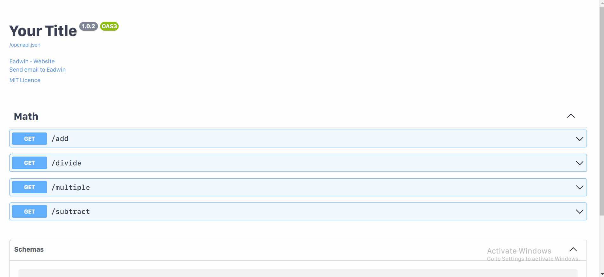

<p align="center">
  <a href="#" target="blank"></a>
</p>

<p align="center"> Ellar is python web framework for building fast, efficient and scalable server-side applications. </p>

## Features
- Pydantic integration
- DI Container
- Templating with Jinja2
- OpenAPI Documentation (Swagger and ReDoc)
- Controller (MVC)
- Guards (Authentications, roles and permissions)
- Modularization (eg: flask blueprint)
- Websocket support
- Session and Cookie support
- CORS, GZip, Static Files, Streaming responses
- Test client built on `requests`
- In-process background tasks.
- Startup and shutdown events.
- Application Events
- Compatible with `asyncio` and `trio` backends.

## Requirements
- Python >= 3.6
- Starlette
- Pydantic
- Injector

## Installation

```
pip install ellar
```

## Usage

Create a file `controller.py`:

```Python
from ellar.common import ModuleRouter, Controller, get

router = ModuleRouter('', tag='Math')


@router.get("/add")
def add(request, a: int, b: int):
    return {"result": a + b}


@Controller("", tag='Math')
class MathAPI:

    @get('/subtract', )
    def subtract(self, a: int, b: int):
        """Subtracts a from b"""
        return {"result": a - b}

    @get('/divide', )
    def divide(self, a: int, b: int):
        """Divides a by b"""
        return {"result": a / b}

    @get('/multiple', )
    def multiple(self, a: int, b: int):
        """Multiples a with b"""
        return {"result": a * b}

```

Create another file `server.py`:

```Python
from ellar.core import AppFactory
from ellar.openapi.builder import OpenAPIDocumentBuilder
from ellar.openapi.module import OpenAPIDocumentModule
from .controller import router, MathAPI


app = AppFactory.create_app(routers=(router, ), controllers=(MathAPI, ))

document_builder = OpenAPIDocumentBuilder()
document_builder.set_title('Your Title')\
    .set_version('1.0.2')\
    .set_contact(name='Eadwin', url='https://www.yahoo.com', email='eadwin@gmail.com')\
    .set_license('MIT Licence', url='https://www.google.com')

document = document_builder.build_document(app)
module = app.install_module(OpenAPIDocumentModule, document=document)
module.setup_swagger_doc()
```

### Start up Server
```bash
uvicorn server:app --reload
```

### Interactive API docs

Now go to <a href="http://localhost:8000/docs/" target="_blank">http://localhost:8000/docs/</a>

You will see the automatic interactive API documentation (provided by <a href="https://github.com/swagger-api/swagger-ui" target="_blank">Swagger UI</a>):



## Status
Project is still in development
- Project CLI scaffolding
- Documentation
- Database Plugin with [Encode/ORM](https://github.com/encode/orm)
- Caching 
- API Throttling
