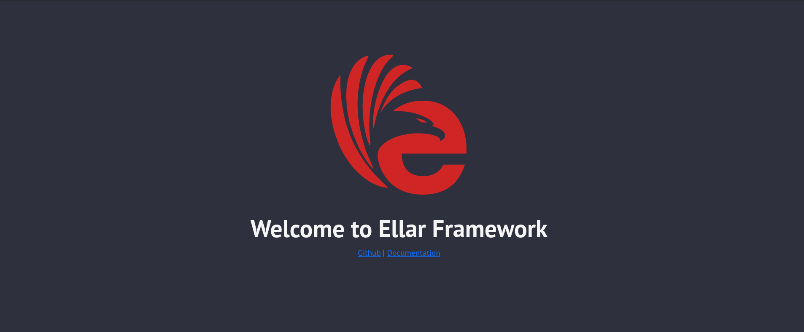

<p align="center">
  <a href="#" target="blank"></a>
</p>

<p align="center"> Ellar - Python ASGI web framework for building fast, efficient and scalable RESTAPIs and server-side application. </p>


[](https://badge.fury.io/py/ellar)
[](https://pypi.python.org/pypi/ellar)
[](https://pypi.python.org/pypi/ellar)

---
## Introduction
Ellar is a lightweight ASGI framework for building efficient and scalable server-side python applications.
It supports both OOP (Object-Oriented Programming) and FP (Functional Programming)


Ellar is built around [Starlette (ASGI toolkit)](https://www.starlette.io/) which processes all the HTTP requests and background tasks. Although, there is a high level 
of abstraction, some concepts of Starlette are still supported.

## Inspiration
Ellar was heavily inspired by [NestJS](https://docs.nestjs.com/) in its simplicity in usage while managing complex project structures and applications. 
It also adopted some concepts of [FastAPI](https://fastapi.tiangolo.com/) in handling request parameters and data serialization with pydantic.
With that said, the aim of Ellar focuses on a high level of abstraction of framework APIs, project structures, architectures, and speed of handling requests.

## Installation
To get started, you need to scaffold a project using [Ellar-CLI](https://eadwincode.github.io/ellar-cli/) toolkit. This is recommended for a first-time user.
The scaffolded project is more like a guide to project setup.

```shell
$(venv) pip install ellar[standard]
$(venv) ellar new project-name
```

### NB:
Some shells may treat square braces (`[` and `]`) as special characters. If that's the case here, then use a quote around the characters to prevent unexpected shell expansion.
```shell
pip install "ellar[standard]"
```

### Py36 Support
For python3.6 users, 
```shell
$(venv) pip install ellar==0.2.2
```

then, start the app with:
```shell
$(venv) ellar runserver --reload
```

Open your browser and navigate to [`http://localhost:8000/`](http://localhost:8000/).


## Features Summary
- `Pydantic integration`
- `Dependency Injection (DI)`
- `Templating with Jinja2`
- `OpenAPI Documentation (Swagger and ReDoc)`
- `Controller (MVC)`
- `Guards (authentications, roles and permissions)`
- `Modularization (eg: flask blueprint)`
- `Websocket support`
- `Session and Cookie support`
- `CORS, GZip, Static Files, Streaming responses`

## Dependency Summary
- `Python >= 3.6`
- `Starlette`
- `Pydantic`
- `Injector`

## Status

Project is still in development

- Documentation - in progress
- Interceptors  -  [Aspect Oriented Programming](https://en.wikipedia.org/wiki/Aspect-oriented_programming) (AOP) technique
- Database Plugin with [Encode/ORM](https://github.com/encode/orm)
- Caching 
- API Throttling
