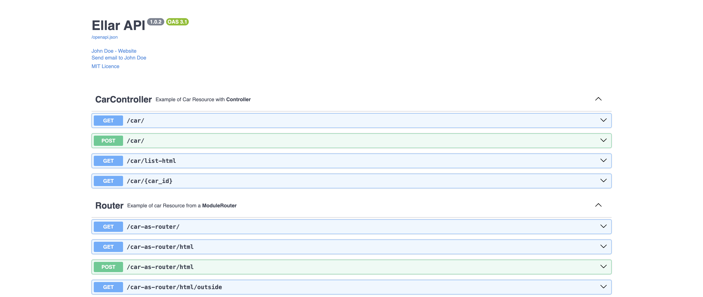
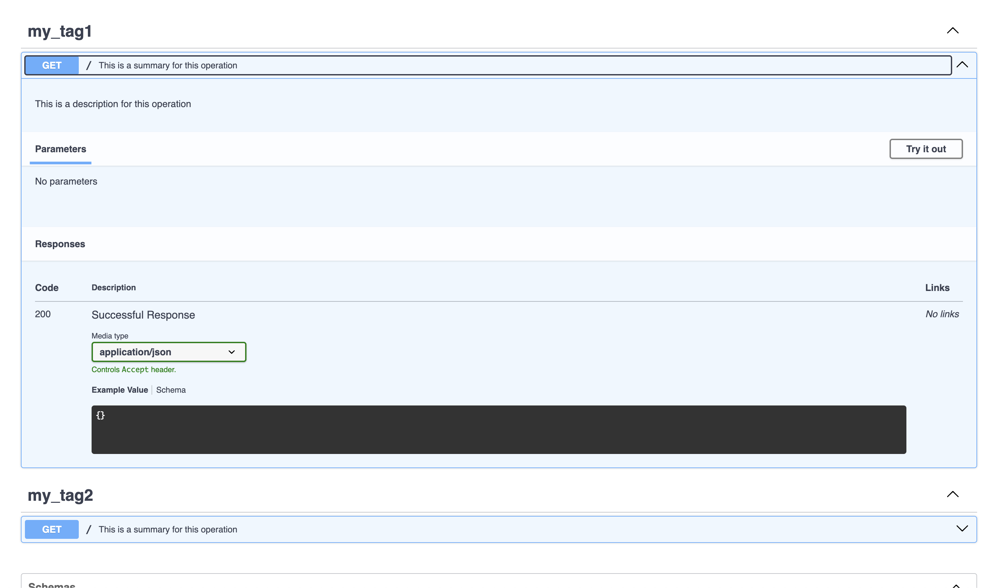

# **OPENAPI**

The [OpenAPI](https://swagger.io/specification/) specification serves as a language-agnostic format for defining RESTful APIs. 
In this section, we'll explore how to generate an OpenAPI schema from controllers and routers that aligns with 
the OpenAPI specification using the **OpenAPIDocumentBuilder** and **OpenAPIDocumentModule** provided in Ellar.

### **OpenAPIDocumentBuilder**
The `OpenAPIDocumentBuilder` helps to structure a base document that conforms to the [OpenAPI Specification](https://swagger.io/specification/#openapi-document). 
It provides several methods that allow setting such properties as title, description, servers, version, etc. 

In order to create a full OPENAPI document (with all HTTP routes defined) we use the `build_document()` method of the OpenAPIDocumentBuilder class. 
The method takes an application instance to generate an OPENAPI schema based on OpenAPI Specification. 

For example, In the [carapp project](https://github.com/python-ellar/ellar/tree/main/examples/01-carapp), we have the following code below:
```python
import os

from ellar.app import AppFactory
from ellar.common.constants import ELLAR_CONFIG_MODULE
from ellar.core import LazyModuleImport as lazyLoad
from ellar.openapi import (
    OpenAPIDocumentBuilder,
)

application = AppFactory.create_from_app_module(
    lazyLoad("carapp.root_module:ApplicationModule"),
    config_module=os.environ.get(
        ELLAR_CONFIG_MODULE, "carapp.config:DevelopmentConfig"
    ),
)

document_builder = OpenAPIDocumentBuilder()
document_builder.set_title("Ellar API") \
    .set_version("1.0.2") \
    .set_contact(name="John Doe", url="https://www.yahoo.com", email="johnDoe@gmail.com") \
    .set_license("MIT Licence", url="https://www.google.com") \
    .add_server('/', description='Development Server')

document = document_builder.build_document(application)
```

### **OpenAPIDocumentModule**

Once we create a document, we can call the `OpenAPIDocumentModule`**.setup()** method. It accepts:

1. The path to mount the [DocumentationUI](./documentation-ui.md)
2. An application instance
3. The document object instantiated above
4. Optional guards list 

```python
import os

from ellar.app import AppFactory
from ellar.common.constants import ELLAR_CONFIG_MODULE
from ellar.core import LazyModuleImport as lazyLoad
from ellar.openapi import (
    OpenAPIDocumentBuilder,
    OpenAPIDocumentModule,
    SwaggerUI
)

application = AppFactory.create_from_app_module(
    lazyLoad("carapp.root_module:ApplicationModule"),
    config_module=os.environ.get(
        ELLAR_CONFIG_MODULE, "carapp.config:DevelopmentConfig"
    ),
)

document_builder = OpenAPIDocumentBuilder()
document_builder.set_title("Ellar API") \
    .set_version("1.0.2") \
    .set_contact(name="John Doe", url="https://www.yahoo.com", email="johnDoe@gmail.com") \
    .set_license("MIT Licence", url="https://www.google.com") \
    .add_server('/', description='Development Server')

document = document_builder.build_document(application)

OpenAPIDocumentModule.setup(
    app=application,
    docs_ui=SwaggerUI(),
    document=document,
    guards=[],
)
```
In the above illustration, we passed application instance, generated document and `SwaggerUI` as the document renderer.

Now you can run the following command to start the HTTP server:
```shell
ellar runserver --reload
```

Since we are using `SwaggerUI`, visit [http://localhost:8000/docs](http://localhost:8000/docs)




## **Operations in OpenAPI**

In the context of OpenAPI, operations refer to the HTTP methods used to manipulate endpoints (resources) 
exposed by your API, such as `GET`, `POST`, or `DELETE`.

We have previously explored in detail how route definitions, input schemas, and response schemas work [here](../techniques/validations).

In this section, we will delve into adding additional OpenAPI context to `Route Functions`, `Controllers`, and `ModuleRouters`.

### **API Info (`api_info`)**

This metadata is attached to a `Route Function` to define specific OpenAPI operation details.

For instance:

```python
from ellar.common import ModuleRouter
from ellar.openapi import api_info

router = ModuleRouter()

@router.get()
@api_info(
    operation_id="unique_id_for_this_operation",
    summary="This is a summary for this operation",
    description="This is a description for this operation",
    tags=['my_tag1', 'my_tag2'],
    deprecated=False,
    extra_operation_property1="extra_operation_property1",
    extra_operation_property2="extra_operation_property2",
)
def index():
    pass
```

This configuration generates the following operation schema:

```json
{
  "paths": {
    "/": {
      "get": {
        "tags": [
          "my_tag1",
          "my_tag2"
        ],
        "summary": "This is a summary for this operation",
        "description": "This is a description for this operation",
        "operationId": "unique_id_for_this_operation",
        "responses": {
          "200": {
            "description": "Successful Response",
            "content": {
              "application/json": {
                "schema": {
                  "type": "object",
                  "title": "Response Model"
                }
              }
            }
          }
        },
        "extra_operation_property1": "extra_operation_property1",
        "extra_operation_property2": "extra_operation_property2"
      }
    }
  }
}
```

Attributes like `extra_operation_property1` and `extra_operation_property2` are custom properties added to the operation schema, extending beyond the standard OpenAPI specification. These can be useful for defining additional attributes specific to the operation.



### **API Tags (`ApiTags`)**

This metadata is attached to `Controllers` and `ModuleRouter` to specify tag information.

For example:

```python
from ellar.common import Controller, ModuleRouter
from ellar.openapi import ApiTags

@Controller
@ApiTags(
    name='ControllerSample', 
    description='SampleController Description', 
    external_doc_description='SampleController Description',
    external_doc_url='https://google.com'
)
class SampleController:
    pass

router = ModuleRouter()
ApiTags(
    name='RouterSample', 
    description='RouterSample Description', 
    external_doc_description='RouterSample Description',
    external_doc_url='https://google.com'
)(router)
```

This setup adds tag information to the overall OpenAPI specification under the `tags` section:

```json
{
  "tags": [
    {
      "name": "RouterSample",
      "description": "RouterSample Description",
      "externalDocs": {
        "description": "RouterSample Description",
        "url": "https://google.com/"
      }
    },
    {
      "name": "ControllerSample",
      "description": "SampleController Description",
      "externalDocs": {
        "description": "SampleController Description",
        "url": "https://google.com/"
      }
    }
  ]
}
```


You can define OpenAPI tags directly on the `Controller` and `ModuleRouter` without using `ApiTags`.
