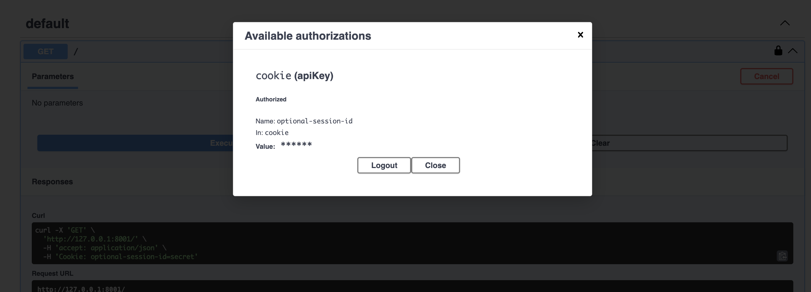
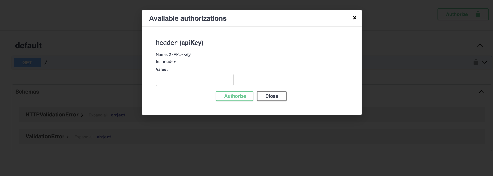
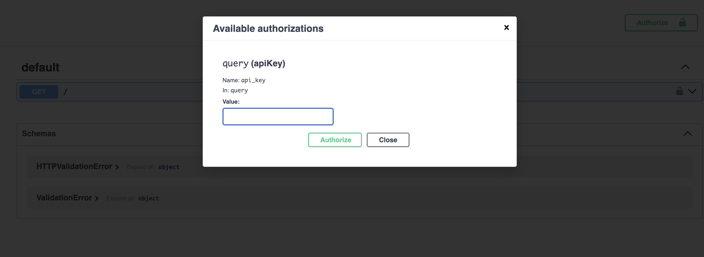
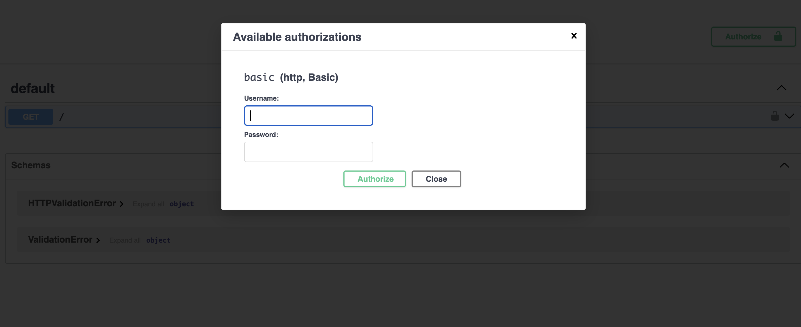
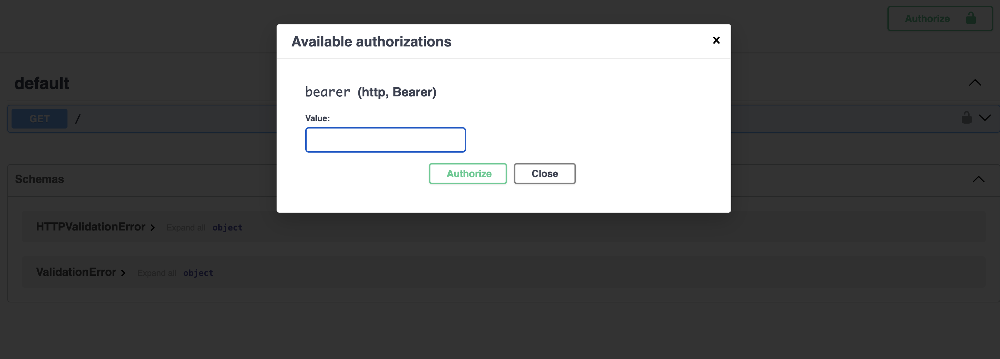

# **Security Schemes in OpenAPI**

Ellar's OpenAPI security is governed by specialized `GuardCanActivate` classes and `AuthenticationHandler` classes.

Reference for more information:

- [Guards](../overview/guards.md).
- [Authentication Handlers](../security/authentication.md#2-authentication-schemes).

### **Cookie Authentication**

Enables cookie-based authentication mechanisms for an operation. Here's an example:

=== "Using Cookie Guard"
    ```python
    import typing as t
    from ellar.common import ModuleRouter, IExecutionContext, UseGuards
    from ellar.auth.guards import GuardAPIKeyCookie
    from ellar.auth import UserIdentity
    from ellar.di import injectable
    
    @injectable
    class MyGuardAPIKeyCookie(GuardAPIKeyCookie):
        parameter_name = 'optional-session-id'
        openapi_name = 'cookie'
    
        async def authentication_handler(self, context:IExecutionContext, key: t.Optional[t.Any]) -> t.Optional[t.Any]:
            if key == "secret":
                return UserIdentity(id=1, first_name='John', last_name='Doe')
            return False
    
    router = ModuleRouter()
    
    @router.get()
    @UseGuards(MyGuardAPIKeyCookie)
    def index(ctx: IExecutionContext):
        return ctx.user

    app = AppFactory.create_app(routers=[router], controllers=[])
    ```
    `GuardAPIKeyCookie` is an abstract class requiring implementation of the `authentication_handler`, 
    which is called after retrieving the key from the request `cookie` using `parameter_name`.

=== "Using Cookie Authentication Handler"
    ```python
    import typing as t
    from ellar.app import AppFactory
    from ellar.common import ModuleRouter, IExecutionContext
    from ellar.auth.handlers import CookieAPIKeyAuthenticationHandler
    from ellar.auth import UserIdentity, AuthenticationRequired
    from ellar.di import injectable
    
    @injectable
    class MyCookieAPIKeyAuthenticationHandler(CookieAPIKeyAuthenticationHandler):
        parameter_name = 'api_key'
        openapi_name = 'cookie'
    
        async def authentication_handler(self, context:IExecutionContext, key: t.Optional[t.Any]) -> t.Optional[t.Any]:
            if key == "secret":
                return UserIdentity(id=1, first_name='John', last_name='Doe')
    
    
    router = ModuleRouter()
    
    @router.get()
    @AuthenticationRequired('cookie')
    def index(ctx: IExecutionContext):
        return ctx.user
    
    
    app = AppFactory.create_app(routers=[router], controllers=[])
    app.add_authentication_schemes(MyCookieAPIKeyAuthenticationHandler)
    ```
    `CookieAPIKeyAuthenticationHandler` is an abstract class requiring implementation of the `authentication_handler`, 
    which is called after retrieving the key from the request `cookie` using `parameter_name`.
    
    When using authentication handlers, `AuthenticationRequired` should to used to protect any endpoint and by passing `openapi_name` as a parameter
    will create necessary OPENAPI security scheme around the decorated Controller or endpoint.
    


### **Header Authentication**

Enables header-based authentication mechanisms for an operation. Example:

=== "Using Header Guard"
    ```python
    import typing as t
    from ellar.common import ModuleRouter, IExecutionContext, UseGuards
    from ellar.auth.guards import GuardAPIKeyHeader
    from ellar.auth import UserIdentity
    from ellar.di import injectable
    
    @injectable
    class MyGuardAPIKeyHeader(GuardAPIKeyHeader):
        parameter_name = 'X-API-Key'
        openapi_name = 'header'
    
        async def authentication_handler(self, context:IExecutionContext, key: t.Optional[t.Any]) -> t.Optional[t.Any]:
            if key == "secret":
                return UserIdentity(id=1, first_name='John', last_name='Doe')
            return False
    
    router = ModuleRouter()
    
    @router.get()
    @UseGuards(MyGuardAPIKeyHeader)
    def index(ctx: IExecutionContext):
        return ctx.user


    app = AppFactory.create_app(routers=[router], controllers=[])
    ```

=== "Using Header Authentication Handler"
    ```python
    import typing as t
    from ellar.app import AppFactory
    from ellar.common import ModuleRouter, IExecutionContext
    from ellar.auth.handlers import HeaderAPIKeyAuthenticationHandler
    from ellar.auth import UserIdentity, AuthenticationRequired
    from ellar.di import injectable
    
    @injectable
    class MyHeaderAPIKeyAuthenticationHandler(HeaderAPIKeyAuthenticationHandler):
        parameter_name = 'X-API-Key'
        openapi_name = 'header'
    
        async def authentication_handler(self, context:IExecutionContext, key: t.Optional[t.Any]) -> t.Optional[t.Any]:
            if key == "secret":
                return UserIdentity(id=1, first_name='John', last_name='Doe')
    
    
    router = ModuleRouter()
    
    @router.get()
    @AuthenticationRequired('header')
    def index(ctx: IExecutionContext):
        return ctx.user
    
    
    app = AppFactory.create_app(routers=[router], controllers=[])
    app.add_authentication_schemes(MyHeaderAPIKeyAuthenticationHandler)
    ```


### **Query Authentication**

Enables query-based authentication mechanisms for an operation. Example:

=== "Using Query Guard"
    ```python
    import typing as t
    from ellar.app import AppFactory
    from ellar.common import ModuleRouter, IExecutionContext, UseGuards
    from ellar.auth.guards import GuardAPIKeyQuery
    from ellar.auth import UserIdentity
    from ellar.di import injectable
    
    @injectable
    class MyGuardAPIKeyQuery(GuardAPIKeyQuery):
        parameter_name = 'api_key'
        openapi_name = 'query'
    
        async def authentication_handler(self, context:IExecutionContext, key: t.Optional[t.Any]) -> t.Optional[t.Any]:
            if key == "secret":
                return UserIdentity(id=1, first_name='John', last_name='Doe')
            return False
    
    router = ModuleRouter()
    
    @router.get()
    @UseGuards(MyGuardAPIKeyQuery)
    def index(ctx: IExecutionContext):
        return ctx.user
    
    app = AppFactory.create_app(routers=[router], controllers=[])
    ```

=== "Using Query Authentication Handler"
    ```python
    import typing as t
    from ellar.app import AppFactory
    from ellar.common import ModuleRouter, IExecutionContext
    from ellar.auth.handlers import QueryAPIKeyAuthenticationHandler
    from ellar.auth import UserIdentity, AuthenticationRequired
    from ellar.di import injectable
    
    @injectable
    class MyQueryAPIKeyAuthenticationHandler(QueryAPIKeyAuthenticationHandler):
        parameter_name = 'api_key'
        openapi_name = 'query'
    
        async def authentication_handler(self, context:IExecutionContext, key: t.Optional[t.Any]) -> t.Optional[t.Any]:
            if key == "secret":
                return UserIdentity(id=1, first_name='John', last_name='Doe')
    
    
    router = ModuleRouter()
    
    @router.get()
    @AuthenticationRequired('query')
    def index(ctx: IExecutionContext):
        return ctx.user
    
    
    app = AppFactory.create_app(routers=[router], controllers=[])
    app.add_authentication_schemes(MyQueryAPIKeyAuthenticationHandler)
    ```


### **Basic Authentication**

Enables basic authentication mechanisms for an operation. Example:

=== "Using HttpBasic Guard"
    ```python
    import typing as t
    from ellar.app import AppFactory
    from ellar.common import ModuleRouter, IExecutionContext, UseGuards
    from ellar.auth.guards import GuardHttpBasicAuth
    from ellar.auth import UserIdentity
    from ellar.di import injectable
    
    @injectable
    class MyGuardHttpBasicAuth(GuardHttpBasicAuth):
        openapi_name = 'basic'
        
        async def authentication_handler(self, context:IExecutionContext, credentials: t.Any) -> t.Optional[t.Any]:
            if credentials.username == "admin" and credentials.password == "secret":
                return UserIdentity(id=1, username='admin', first_name='John', last_name='Doe')
            return False
    
    router = ModuleRouter()
    
    @router.get()
    @UseGuards(MyGuardHttpBasicAuth)
    def index(ctx: IExecutionContext):
        return ctx.user
    
    
    app = AppFactory.create_app(routers=[router], controllers=[])
    ```

=== "Using HttpBasic Authentication Handler"
    ```python
    import typing as t
    from ellar.app import AppFactory
    from ellar.common import ModuleRouter, IHostContext, IExecutionContext
    from ellar.auth.handlers import HttpBasicAuthenticationHandler
    from ellar.auth import UserIdentity, AuthenticationRequired
    from ellar.di import injectable
    
    
    @injectable
    class MyHttpBasicAuthenticationHandler(HttpBasicAuthenticationHandler):
        openapi_name = 'basic'
        
        async def authentication_handler(self, context: IHostContext, credentials: t.Any) -> t.Optional[t.Any]:
            if credentials.username == "admin" and credentials.password == "secret":
                return UserIdentity(id=1, username='admin', first_name='John', last_name='Doe')
    
    
    router = ModuleRouter()
    
    @router.get()
    @AuthenticationRequired('basic')
    def index(ctx: IExecutionContext):
        return ctx.user
    
    
    app = AppFactory.create_app(routers=[router], controllers=[])
    app.add_authentication_schemes(MyHttpBasicAuthenticationHandler)
    ```



### **Bearer Authentication**

Enables bearer authentication mechanisms for an operation. Example:

=== "Using HttpBearer Guard"
    ```python
    import typing as t
    from ellar.app import AppFactory
    from ellar.auth.guards import GuardHttpBearerAuth
    from ellar.auth import UserIdentity
    from ellar.common import ModuleRouter, IExecutionContext, UseGuards
    from ellar.di import injectable
    
    @injectable
    class MyGuardHttpBearerAuth(GuardHttpBearerAuth):
        openapi_name = 'bearer'
    
        async def authentication_handler(self, context:IExecutionContext, credentials: t.Any) -> t.Optional[t.Any]:
            if credentials.credentials == "secret":
                return UserIdentity(id=1, username='admin', first_name='John', last_name='Doe')
            return False
    
    router = ModuleRouter()
    
    @router.get()
    @UseGuards(MyGuardHttpBearerAuth)
    def index(ctx: IExecutionContext):
        return ctx.user
    
    app = AppFactory.create_app(routers=[router], controllers=[])
    ```

=== "Using HttpBearer Authentication Handler"
    ```python
    import typing as t
    from ellar.app import AppFactory
    from ellar.common import ModuleRouter, IExecutionContext
    from ellar.auth.handlers import HttpBearerAuthenticationHandler
    from ellar.auth import UserIdentity, AuthenticationRequired
    from ellar.di import injectable
    
    
    @injectable
    class MyHeaderAPIKeyAuthenticationHandler(HttpBearerAuthenticationHandler):
        openapi_name = 'bearer'
    
        async def authentication_handler(self, context:IExecutionContext, credentials: t.Any) -> t.Optional[t.Any]:
            if credentials.credentials == "secret":
                return UserIdentity(id=1, username='admin', first_name='John', last_name='Doe')
    
    
    router = ModuleRouter()
    
    @router.get()
    @AuthenticationRequired('bearer')
    def index(ctx: IExecutionContext):
        return ctx.user
    
    
    app = AppFactory.create_app(routers=[router], controllers=[])
    app.add_authentication_schemes(MyHeaderAPIKeyAuthenticationHandler)
    ```


