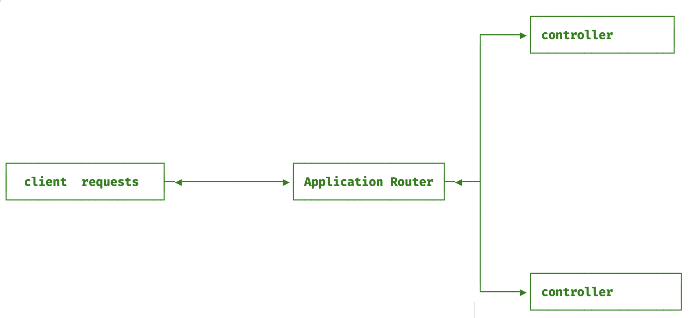
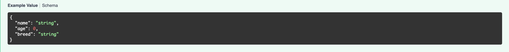
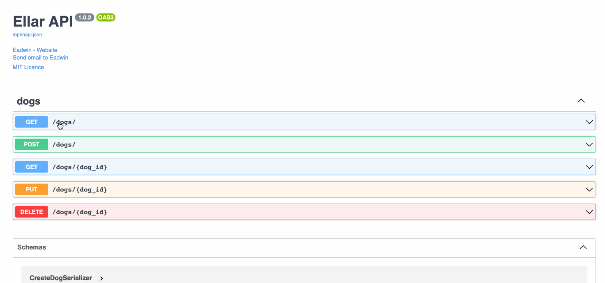

The Controller is responsible for handling incoming requests and returning responses to the client.
The purpose of a controller is to receive specific requests for an application `ApplicationRouter`. `ApplicationRouter` on the other hand, decides which `controller` should handle an incoming request.



Controllers can be said to be a router with many routes registered in them.

### **Creating a Controller**
To create a controller, we use classes and decorators. The `Controller` decorator associates classes with a required
`metadata` needed for Ellar to create a routing table

```python
from ellar.common import Controller
from ellar.core import ControllerBase

@Controller()
class UsersController(ControllerBase):
    """We have created a controller for Users"""
```

## **Routing**
In this section, we are going to highlight key features of the `@Controller()`, a `class decorator` 
for defining a controller. By default, `@Controller()` will create a path prefix `/dogs` gotten from the class name in `Dogs`Controller. This will be used to group related routes and minimize duplicate route definitions.

For example, we may choose to group a set of routes that manage interactions with a customer entity under the route `/users`. In that case, we could specify the path prefix `/users` in the `@Controller()` decorator so we don't have to repeat that portion of the path for each route in the controller.

```python
# project_name/apps/dogs/controllers.py

from ellar.common import Controller, get
from ellar.core import ControllerBase

@Controller('/dogs')
class DogsController(ControllerBase):
    @get()
    def get_all(self):
        return 'This action returns all dogs'
    
    @get("/welcome")
    def index(self):
        return {"detail": "Welcome to Dogs Resource"}
```

!!! hint
    Class Decorators name are capitalized while function/method decorator name are in lower case

The `@get()` HTTP method decorator before the `get_all(self)` method marks `get_all(self)` as the HTTP request handler that will handle a specific endpoint matching the route path and HTTP method of `GET`. 

But what then is the route path of `get_all(self)`? The route path is determined by concatenating the controller `path prefix` and the path specified in the HTTP method function decorator `@get()`.

For example, we've declared a prefix for every route `(dogs)`, and haven't added any path information in the decorator, which means the path will default to `/`. In that case,
Ellar will map `GET /dogs/` requests to the `get_all(self)` handler.

Another example to help make things clear, a path prefix of `/users` combined with the decorator `@get('/profile')` would produce a route mapping for requests like
`GET /users/profile`.


### **Overview of HTTP function decorator parameters:**

`@get(path: str, name: str, include_in_schema: bool, response: t.Union[t.Dict[int, t.Type], t.List[t.Tuple[int, t.Type]], t.Type])`

- `path`: defines the path for route mapping. `default='/'`
- `name`: defines a `name` that will be used to identify this route during URL reversing. default is function name eg: `get_all`
- `include_in_schema`: indicates if an endpoint should be available in OPENAPI docs
- `response`: defines different response `schema`, `status code`, and `Response` type that is available on the endpoint.
This is only necessary for OPENAPI documentation. default: `None`

Ellar serializes all route handler returned data to `JSON` unless the data returned is a `Response` object.
For the above example, `get_all` returned a string. This will be serialized to JSON with a status code 200.

## **Request Object**
There are different ways handlers can access client request details:

### **Annotation (`parameter_name:Request`)**

Ellar will resolve any parameter annotated as `Request` in the request handler signature as a `Request` object.
```python
# project_name/apps/dogs/controllers.py

from ellar.common import Controller, get
from ellar.core import ControllerBase, Request

@Controller('/dogs')
class DogsController(ControllerBase):
    @get()
    def get_all(self, request: Request):
        assert isinstance(request, Request) # True
        return 'This action returns all dogs'
    
    ...
```

### **injection (`parameter_name=Req()`)**

We can also inject request object to any handler by using `@Req` decorator in handler signature.
```python
# project_name/apps/dogs/controllers.py

from ellar.common import Controller, get, Req
from ellar.core import ControllerBase, Request

@Controller('/dogs')
class DogsController(ControllerBase):
    @get()
    def get_all(self, req_data: Request, req_data_2=Req()):
        assert isinstance(req_data, Request) # True
        assert isinstance(req_data_2, Request)
        assert req_data == req_data_2
        return 'This action returns all dogs'
    ...
```

### **Controllers Context**

During request handler execution, `Execution Context` is available on the Controller instance and the `request` object can be gotten from the context.
```python
# project_name/apps/dogs/controllers.py

from ellar.common import Controller, get
from ellar.core import ControllerBase, Request

@Controller('/dogs')
class DogsController(ControllerBase):
    @get()
    def get_all(self):
        assert isinstance(self.context.switch_to_http_connection().get_request(), Request) # True
        return 'This action returns all dogs'
    ...
```

Other request `handler` signature injectors

|             |                                                                                                        |
|-------------|--------------------------------------------------------------------------------------------------------|
| `Req()`     | for `Request` object                                                                                   |
| `Res()`     | for `Response` object                                                                                  |
| `Path()`    | pydantic field - resolves path parameters                                                              |
| `Body()`    | pydantic field - resolves required Request `body` parameters                                           |
| `Form()`    | pydantic field - resolves required Request `body` parameters with content-type=`x-www-form-urlencoded` |
| `Header()`  | pydantic field - resolves required Request `header` parameters                                         |
| `Query()`   | pydantic field - resolves required Request `query` parameters                                          |
| `File()`    | pydantic field - resolves required Request `body` parameters with content-type=`x-www-form-urlencoded` |
| `Ctx()`     | Injects `ExecutionContext`.                                                                            |
| `Cookie()`  | pydantic field - resolves required Request `cookie` parameters                                         |
| `Session()` | injects Request session data                                                                           |
| `Host()`    | injects Request clients host                                                                           |
| `Provide()` | injects services                                                                                       |

## **Resource**

Let add create endpoint to our `DogsController` resource.
```python
# project_name/apps/dogs/controllers.py

from ellar.common import Controller, get, post
from ellar.core import ControllerBase, Request

@Controller('/dogs')
class DogsController(ControllerBase):
    @post()
    def create(self):
        return 'This action adds a new dog'
    
    @get()
    def get_all(self):
        assert isinstance(self.context.switch_to_http_connection().get_request(), Request) # True
        return 'This action returns all dogs'
    ...
```

### **HTTP Methods**

Ellar provides decorators for all the standard HTTP methods:

- `@get`  - `GET` HTTP method
- `@post` - `POST` HTTP method
- `@put` - `PUT` HTTP method
- `@patch` - `PATCH` HTTP method
- `@delete` - `DELETE` HTTP method
- `@trace` - `TRACE` HTTP method
- `@options` - `OPTIONS` HTTP method
- `@head` - `HEAD` HTTP method
- `@http_route` - allows one or more HTTP methods combination, eg: `@http_route(methods=['PUT', 'PATCH'])`

## **Asynchronicity**

Ellar supports modern asynchronous programming in python using `async` and `await` syntax.

```python
# project_name/apps/dogs/controllers.py

from ellar.common import Controller, get, post
from ellar.core import ControllerBase, Request

@Controller('/dogs')
class DogsController(ControllerBase):
    @post()
    async def create(self):
        return 'This action adds a new dog'
    
    @get()
    async def get_all(self):
        assert isinstance(self.context.switch_to_http_connection().get_request(), Request) # True
        return 'This action returns all dogs'
    ...
```

## **Request Payload**

Let's use `@Body()` to define the required data to create a dog in our previous `create`(POST) endpoint.
Before that, we need to define our data input/output serializers

```python
# project_name/apps/dogs/schema.py
from ellar.serializer import DataclassSerializer, Serializer
from pydantic import Field


class CreateDogSerializer(Serializer):
    name: str
    age: int = Field(..., gt=0)
    breed: str


class DogListFilter(Serializer):
    offset: int = 1
    limit: int = 10

    
class RetrieveDogSerializer(Serializer):
    id: str
    name: str
    age: int
    breed: str
```

Let's add the `CreateDogSerializer` to `create` endpoint,
```python
# project_name/apps/dogs/controllers.py
...
from ellar.common import Body
from .schemas import CreateDogSerializer


@post()
async def create(self, payload: CreateDogSerializer = Body()):
    return 'This action adds a new dog'
```

`CreateDogSerializer` is a pydantic type. These means `name`, `age` and `breed` fields are type validated out of the box. 

It's important to note the way we used `CreateDogSerializer` as a type annotation of the `payload` parameter in the `create` route handler method. 
Ellar will compute values for all the route handler parameters and validates them based on the annotated types before executing the handler. 

!!! info
    if a parameter is not annotated, it will be assumed as a `string` type



Let's add other endpoints

```python
# project_name/apps/dogs/controllers.py

from ellar.common import Body, Controller, delete, get, post, put, Query
from ellar.core import ControllerBase, Request
from .schemas import CreateDogSerializer, DogListFilter


@Controller('/dogs')
class DogsController(ControllerBase):
    @post()
    async def create(self, payload: CreateDogSerializer = Body()):
        result = payload.dict()
        result.update(message='This action adds a new dog')
        return result

    @put('/{dog_id:str}')
    async def update(self, dog_id: str, payload: CreateDogSerializer = Body()):
        result = payload.dict()
        result.update(message=f'This action updated #{dog_id} dog resource')
        return result

    @get('/{dog_id:str}')
    async def get_one(self, dog_id: str):
        return f"This action returns a #{dog_id} dog"

    @delete('/{dog_id:str}')
    async def delete(self, dog_id: str):
        return f"This action removes a #{dog_id} dog"

    @get()
    async def get_all(self, query: DogListFilter = Query()):
        assert isinstance(self.context.switch_to_http_connection().get_request(), Request)  # True
        return f'This action returns all dogs at limit={query.limit}, offset={query.offset}'

```
## **Linking Controller**

In the previous page, we already wired our `dogs` module (`DogsModule`) to `ApplicationModule` in `project_name/root_module` but this time we shall be adding things to the `DogsModule`. To keep things more simple, organized, and modular.

Let's register `DogsController` to `DogsModule`.
`@Module()` takes `controllers` as a parameter which is an array of the `ControllerBase` type.

In the `dogs` module,

```python
# project_name/apps/dogs/module.py

from ellar.common import Module
from ellar.core import ModuleBase
from ellar.di import Container

from .controllers import DogsController


@Module(
    controllers=[DogsController],
    providers=[],
    routers=[],
)
class DogsModule(ModuleBase):
    def register_providers(self, container: Container) -> None:
        # for more complicated provider registrations
        # container.register_instance(...)
        pass
```


