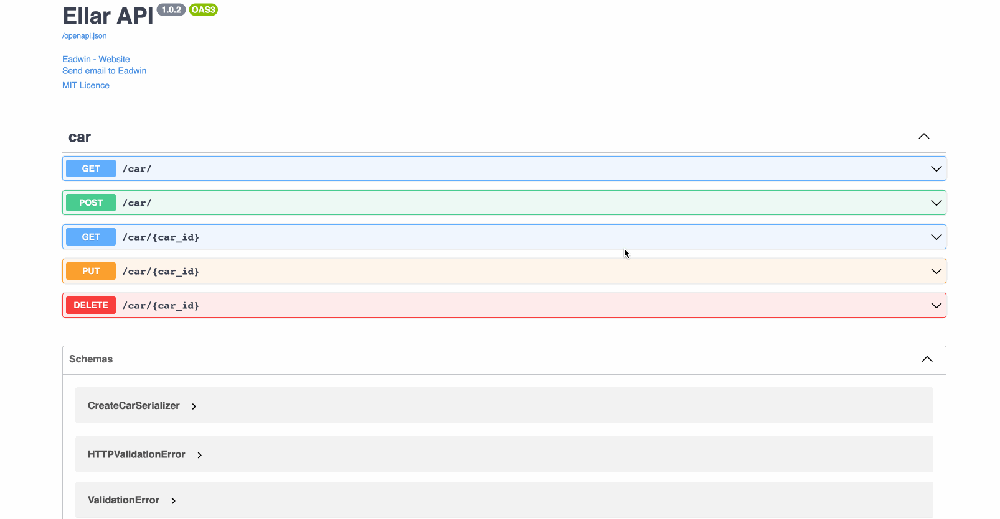

# **Controllers**
The Controller plays a crucial role in managing incoming requests and providing responses to clients. 
Its primary function is to handle specific requests directed to an application's `ApplicationRouter`. 
In turn, the `ApplicationRouter` determines the appropriate `controller` to manage the incoming request.


Conceptually, controllers can be likened to routers with multiple registered routes within them.

### **Creating a Controller**
To create a controller, we use classes and decorators. The `Controller` decorator associates classes with a required
`metadata` needed for Ellar to create a routing table

```python
from ellar.common import Controller, ControllerBase

@Controller()
class UserController(ControllerBase):
    """We have created a controller that will manage our Users"""
```

## **Routing**
In this section, we will outline the key features of `@Controller()`, a `class decorator` designed for defining a controller. 
By default, when applied, `@Controller()` generates a path prefix based on the class name, such as `/car` 
for a controller named `CarController`. This feature aims to organize and group related routes, reducing redundancy in route definitions.

For instance, if we want to group a collection of routes managing interactions with a customer entity under the route `/user`, 
we can specify the path prefix `/user` in the `@Controller()` decorator. 
This ensures that we don't need to repeat this portion of the path for each route within the controller.
```python
# project_name/apps/car/controllers.py

from ellar.common import Controller, get, ControllerBase

@Controller('/car')
class CarController(ControllerBase):
    @get()
    def get_all(self):
        return 'This action returns all car'
    
    @get("/welcome")
    def index(self):
        return {"detail": "Welcome to Car Resource"}
```

!!! hint
    Class decorators are conventionally named with capital letters, while function/method decorator names typically use lowercase letters.


The `@get()` HTTP method decorator preceding the `get_all(self)` method designates `get_all(self)` as the HTTP request 
handler responsible for handling a specific endpoint matching the route path and HTTP method of `GET`.

But what exactly is the route path for `get_all(self)`? The route path is determined by combining the controller's 
`path prefix` and the path specified in the HTTP method function decorator `@get()`.

For instance, if we've set a prefix for every route `(car)` and haven't added any path information in the
decorator, it means the path defaults to `/`. In this case, Ellar will associate `GET /car/` requests with the `get_all(self)` handler.

To illustrate further, if we have a path prefix of `/users` and include the decorator `@get('/profile')`, 
it would result in a route mapping for requests like `GET /users/profile`.


### **Overview of HTTP function decorator parameters:**

`@get(path: str, name: str, include_in_schema: bool, response: t.Union[t.Dict[int, t.Type], t.List[t.Tuple[int, t.Type]], t.Type])`

- `path`: defines the path for route mapping. `default='/'`
- `name`: defines a `name` that will be used to identify this route during URL reversing. default is function name eg: `get_all`
- `include_in_schema`: indicates if an endpoint should be available in OPENAPI docs
- `response`: defines different response `schema`, `status code`, and `Response` type that is available on the endpoint.
This is only necessary for OPENAPI documentation. default: `None`

Ellar serializes all route handler returned data to `JSON` unless the data returned is a `Response` object.
For the above example, `get_all` returned a string. This will be serialized to JSON with a status code 200.

## **Request Object**
There are different ways handlers can access client request details:

### **Annotation (`parameter_name:Request`)**

Ellar will resolve any parameter annotated as `Request` in the request handler signature as a `Request` object.
```python
# project_name/apps/car/controllers.py

from ellar.common import Controller, get, ControllerBase
from ellar.core import Request

@Controller('/car')
class CarController(ControllerBase):
    @get()
    def get_all(self, request: Request):
        assert isinstance(request, Request) # True
        return 'This action returns all cars'
    
    ...
```

### **injection (`parameter_name=Inject[Request]`)**

We can also inject request object to any handler by using `Inject[Request]` decorator in handler signature.
```python
# project_name/apps/car/controllers.py

from ellar.common import Controller, ControllerBase, get, Inject
from ellar.core import Request

@Controller('/car')
class CarController(ControllerBase):
    @get()
    def get_all(self, req_data: Request, req_data_2: Inject[Request]):
        assert isinstance(req_data, Request) # True
        assert isinstance(req_data_2, Request)
        assert req_data == req_data_2
        return 'This action returns all cars'
    ...
```

### **Controllers Context**

During request handler execution, `Execution Context` is available on the Controller instance and the `request` object can be gotten from the context.
```python
# project_name/apps/car/controllers.py

from ellar.common import Controller, ControllerBase, get
from ellar.core import Request

@Controller('/car')
class CarController(ControllerBase):
    @get()
    def get_all(self):
        assert isinstance(self.context.switch_to_http_connection().get_request(), Request) # True
        return 'This action returns all cars'
    ...
```

Other request `handler` signature injectors

|                                       |                                                                                                        |
|---------------------------------------|--------------------------------------------------------------------------------------------------------|
| `Inject[Request]`                     | for `Request` object                                                                                   |
| `Inject[Response]`                    | for `Response` object                                                                                  |
| `Path()`                              | pydantic field - resolves path parameters                                                              |
| `Body()`                              | pydantic field - resolves required Request `body` parameters                                           |
| `Form()`                              | pydantic field - resolves required Request `body` parameters with content-type=`x-www-form-urlencoded` |
| `Header()`                            | pydantic field - resolves required Request `header` parameters                                         |
| `Query()`                             | pydantic field - resolves required Request `query` parameters                                          |
| `File()`                              | pydantic field - resolves required Request `body` parameters with content-type=`x-www-form-urlencoded` |
| `Inject[ExecutionContext]`            | Injects `ExecutionContext`.                                                                            |
| `Cookie()`                            | pydantic field - resolves required Request `cookie` parameters                                         |
| `Inject[dict, Inject.Key('Session')]` | injects Request session data                                                                           |
| `Inject[str, Inject.Key('Host')]`     | injects Request clients host                                                                           |
| `Inject[Type]`                        | injects services                                                                                       |

## **Resource**

Let add create endpoint to our `CarController` resource.
```python
# project_name/apps/car/controllers.py

from ellar.common import Controller, ControllerBase, get, post
from ellar.core import Request

@Controller('/car')
class CarController(ControllerBase):
    @post()
    def create(self):
        return 'This action adds a new car'
    
    @get()
    def get_all(self):
        assert isinstance(self.context.switch_to_http_connection().get_request(), Request) # True
        return 'This action returns all cars'
    ...
```

### **HTTP Methods**

Ellar provides decorators for all the standard HTTP methods:

- `@get`  - `GET` HTTP method
- `@post` - `POST` HTTP method
- `@put` - `PUT` HTTP method
- `@patch` - `PATCH` HTTP method
- `@delete` - `DELETE` HTTP method
- `@trace` - `TRACE` HTTP method
- `@options` - `OPTIONS` HTTP method
- `@head` - `HEAD` HTTP method
- `@http_route` - allows one or more HTTP methods combination, eg: `@http_route(methods=['PUT', 'PATCH'])`

## **Asynchronicity**

Ellar supports modern asynchronous programming in python using `async` and `await` syntax.

```python
# project_name/apps/car/controllers.py

from ellar.common import Controller, ControllerBase, get, post
from ellar.core import Request

@Controller('/car')
class CarController(ControllerBase):
    @post()
    async def create(self):
        return 'This action adds a new car'
    
    @get()
    async def get_all(self):
        assert isinstance(self.context.switch_to_http_connection().get_request(), Request) # True
        return 'This action returns all cars'
    ...
```

## **Request Payload**

Let's use `@Body()` to define the required data to create a car in our previous `create`(POST) endpoint.
Before that, we need to define our data input/output serializers

```python
# project_name/apps/car/schema.py
from ellar.common import Serializer
from pydantic import Field


class CreateCarSerializer(Serializer):
    name: str
    year: int = Field(..., gt=0)
    model: str


class CarListFilter(Serializer):
    offset: int = 1
    limit: int = 10

    
class CarSerializer(Serializer):
    id: str
    name: str
    year: int
    model: str
```

Let's add the `CreateCarSerializer` to `create` endpoint,
```python
# project_name/apps/car/controllers.py
...
from ellar.common import Body, post
from .schemas import CreateCarSerializer


@post()
async def create(self, payload: Body[CreateCarSerializer]):
    return 'This action adds a new car'
```

`CreateCarSerializer` is a Pydantic type, which implies that the `name`, `year`, and `model` fields undergo automatic type validation.

It's crucial to observe how we utilized `CreateCarSerializer` as a type annotation for the `payload` parameter in the `create` 
route handler method. Ellar will calculate values for all route handler parameters and validate them according to 
the annotated types before executing the handler.

!!! info
    if a parameter is not annotated, it will be assumed as a `string` type


Let's add other endpoints

```python
# project_name/apps/car/controllers.py

from ellar.common import Body, Controller, ControllerBase, delete, get, post, put, Query
from ellar.core import Request
from .schemas import CreateCarSerializer, CarListFilter


@Controller('/car')
class CarController(ControllerBase):
    @post()
    async def create(self, payload:Body[CreateCarSerializer]):
        result = payload.dict()
        result.update(message='This action adds a new car')
        return result

    @put('/{car_id:str}')
    async def update(self, car_id: str, payload:Body[CreateCarSerializer]):
        result = payload.dict()
        result.update(message=f'This action updated #{car_id} car resource')
        return result

    @get('/{car_id:str}')
    async def get_one(self, car_id: str):
        return f"This action returns a #{car_id} car"

    @delete('/{car_id:str}')
    async def delete(self, car_id: str):
        return f"This action removes a #{car_id} car"

    @get()
    async def get_all(self, query:Query[CarListFilter]):
        assert isinstance(self.context.switch_to_http_connection().get_request(), Request)  # True
        return f'This action returns all cars at limit={query.limit}, offset={query.offset}'

```
## **Linking Controller**

On the preceding page, we successfully connected our `car` module (`CarModule`) to the `ApplicationModule` in `project_name/root_module`. 
However, this time, we will be introducing modifications to the `CarModule` to keep things simple, organized and modular.

To achieve this, let's include the registration of `CarController` within the `CarModule`. 
The `@Module()` decorator accepts a `controllers` parameter, which is an array of the `ControllerBase` type.

In the `car/module.py`,

```python
# project_name/apps/car/module.py

from ellar.common import Module
from ellar.core import ModuleBase
from ellar.di import Container

from .controllers import CarController


@Module(
    controllers=[CarController],
    providers=[],
    routers=[],
)
class CarModule(ModuleBase):
    def register_providers(self, container: Container) -> None:
        # for more complicated provider registrations
        # container.register_instance(...)
        pass
```


