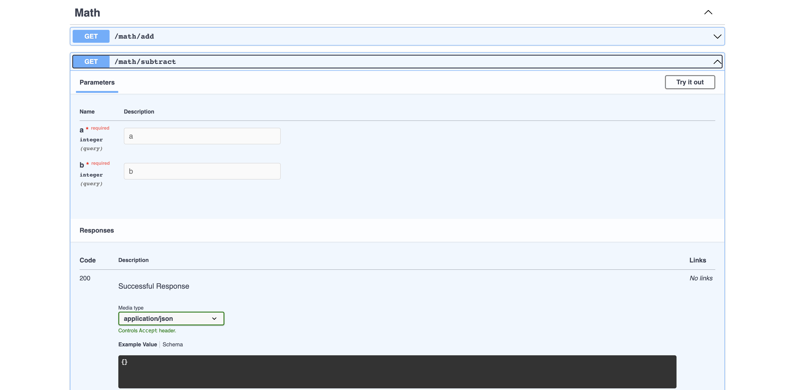

# Module Router

ModuleRouter allows you to define your route handlers as standalone functions, providing an alternative to using classes. 
This can be beneficial for python developers who prefer using functions. 
It is important to note that using ModuleRouter does not limit your access to other features provided by Ellar.

## **Usage**
The Ellar CLI tool generates a `routers.py` file in every `create-module` scaffold command. 
This file contains a quick guide on how to use the `ModuleRouter` class.

Let's use the **routers.py** created in our previous project. And create **two** route functions, **addition** and **subtraction** 

```python
# project_name/apps/dogs/routers.py
"""
Define endpoints routes in python function fashion
example:

my_router = ModuleRouter("/cats", tag="Cats", description="Cats Resource description")

@my_router.get('/')
def index(request: Request):
    return {'detail': 'Welcome to Cats Resource'}
"""
from ellar.common import ModuleRouter

math_router = ModuleRouter('/math', tag='Math')

@math_router.get('/add')
def addition(a:int, b:int):
    return a + b


@math_router.get('/subtract')
def subtraction(a:int, b:int):
    return a - b
```
In the example above, we created `math_router` with a prefix `/math` and a OPENAPI tag 'math'. Then we added two routes `addition(a:int, b:int)` and `subtraction(a:int, b:int)`. 
Each route takes two query parameters, 'a' and 'b' which are declared as int type. These functions handle the query parameters and return the result of the mathematical operation.

Next, we have to make the `math_router` visible to the application

## **Registering Module Router**
Like controllers, ModuleRouters also need to be registered to their root module in order to be used in a web application. 
In the example provided above, the `math_router` would be registered under the `project_name/apps/dogs/module.py` file.

This registration process typically involves importing the `math_router` and then adding it to the list of `routers` in the `module.py` file. 
This allows the router to be recognized by the application and its routes to be available to handle requests.

```python

from ellar.common import Module
from ellar.core import ModuleBase
from ellar.di import Container

from .controllers import DogsController
from .routers import math_router


@Module(
    controllers=[DogsController],
    providers=[],
    routers=[math_router],
)
class DogsModule(ModuleBase):
    def register_providers(self, container: Container) -> None:
        # for more complicated provider registrations
        # container.register_instance(...)
        pass
```




## **Accessing Other Request Object**
In functional route handle, we can access request object and response object through custom decorators or type annotation as shown below.

### By Type Annotation
Let's inject request and response object in `addition` route handler function from our previous example

```python
from ellar.core import Request, Response
from ellar.common import ModuleRouter


math_router = ModuleRouter('/math', tag='Math')

@math_router.get('/add')
def addition(request: Request, res: Response, a:int, b:int):
    res.headers['x-operation'] = 'Addition'
    return dict(is_request_object=isinstance(request, Request), is_response_object=isinstance(res, Response), operation_result=a + b)

```

### **By Custom decorators**
You can also achieve the same result by using custom decorator.

```python
from ellar.core import Request, Response
from ellar.common import ModuleRouter, Req, Res


math_router = ModuleRouter('/math', tag='Math')

@math_router.get('/add')
def addition(*, request=Req(), res=Res(), a:int, b:int):
    res.headers['x-operation'] = 'Addition'
    return dict(is_request_object=isinstance(request, Request), is_response_object=isinstance(res, Response), operation_result=a + b)

```


## **Inject Services**
We can also inject service providers just like controller routes using the `Provide` function.

```python
from ellar.core import Request, Response, IExecutionContext
from ellar.common import ModuleRouter, Provide


math_router = ModuleRouter('/math', tag='Math')

@math_router.get('/subtract')
def subtraction(a:int, b:int, res=Provide(Response), req=Provide(Request), ctx=Provide(IExecutionContext)):
    res.headers['x-operation'] = 'Subtraction'
    return dict(
        is_request_object=isinstance(req, Request), 
        is_response_object=isinstance(res, Response),
        is_context_object=isinstance(ctx, IExecutionContext),
        operation_result=a - b
    )

```
