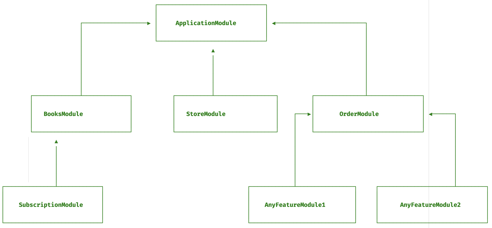

A module is a class annotated with a `@Module()` decorator.
The `@Module()` decorator provides **metadata** that exports a `Module` data and defines the module structure.



The best way to organize your components is to build your projects as `Modules`.

The `ApplicationModule` is the entry-point/root module to building the application module tree -
the internal data structure used to resolve `module` and `provider` relationships and dependencies.

Thus, the architecture resulting from most applications will include multiple modules with closely related **functionality**.

## **Feature modules**
Building an application as a group of feature modules bundled together helps to manage complexity, have a maintainable, extendable, and testable code base, and encourage development using SOLID principles.

A typical example of a feature module is the **dogs** project. The `DogsModule` wraps all the services and controller that manages the `dog` resource which makes it easy to maintain, extend, and testable.
```python
# project_name/apps/dogs/module.py

from ellar.common import Module
from ellar.core import ModuleBase
from ellar.di import Container
from .services import DogsRepository
from .controllers import DogsController


@Module(
    controllers=[DogsController],
    providers=[DogsRepository],
)
class DogsModule(ModuleBase):
    def register_providers(self, container: Container) -> None:
        # for more complicated provider registrations
        # container.register_instance(...)
        pass
```

## **Module Parameters**
Let's create a Module and take a quick overview of its parameters.

```python
from ellar.common import Module
from ellar.core import ModuleBase

@Module(
    name='', 
    modules=[], 
    providers=[],
    controllers=[],
    routers=[],
    commands=[],
    base_directory=None, 
    static_folder='static', 
    template_folder='templates'
)
class BookModule(ModuleBase):
    pass

```

|                   |                                                                                                                              |
|-------------------|------------------------------------------------------------------------------------------------------------------------------|
| `name`            | name of the module - it's irrelevant at the moment.                                                                          |
| `modules`         | List of Module dependencies                                                                                                  |
| `providers`       | the providers that will be instantiated by the Ellar injector and that may be shared at least across this module             |
| `controllers`     | the set of controllers defined in this module which have to be instantiated                                                  |
| `routers`         | the set of `ModuleRouter` defined in this module                                                                             |
| `commands`        | the set of `EllarTyper` or `command` decorated functions                                                                     |
| `base_directory`  | root directory for this module to read `static_folder` and `template_folder`. Default is the root folder of the Module Class |
| `static_folder`   | defines the static folder for this module - default: `static`                                                                |
| `template_folder` | defines the template folder for this module - default: `templates`                                                           |


## **Additional Module Configurations**

### **Module Events**
Every registered Module receives two event calls during its instantiation and when the application is ready.

```python
from ellar.common import Module
from ellar.core import ModuleBase, Config, App

@Module()
class ModuleEventSample(ModuleBase):
    @classmethod
    def before_init(cls, config: Config) -> None:
        """Called before creating Module object"""
    
    def application_ready(self, app: App) -> None:
        """Called when application is ready - this is similar to @on_startup event"""

```
`before_init` receives current app `Config` as a parameter and `application_ready` function receives `App` instance as parameter.

####  **Starlette Application Events**
We can register multiple event handlers for dealing with `tasks` that need to run before
the application starts `up`, or when the application is shutting `down`.
This is the way we support `Starlette` start-up events in `Ellar`

```python

from ellar.common import Module, on_shutdown, on_startup
from ellar.core import ModuleBase

@Module()
class ModuleRequestEventsSample(ModuleBase):
    @on_startup
    def on_startup_func(cls):
        pass
    
    @on_startup()
    async def on_startup_func_2(cls):
        pass
    
    @on_shutdown
    def on_shutdown_func(cls):
        pass
    
    @on_shutdown()
    async def on_shutdown_func_2(cls):
        pass
```
These will be registered to the application router during the `ModuleRequestEventsSample` computation at runtime.
Also, the events can be `async` as in the case of `on_shutdown_func_2` and `on_startup_func_2`

### **Module Exceptions**
Custom exception handlers can be registered through modules.

```python
from ellar.common import Module, exception_handler
from ellar.core import  ModuleBase, JSONResponse, Response
from ellar.core.context import IHostContext

@Module()
class ModuleExceptionSample(ModuleBase):
    @exception_handler(404)
    def exception_404_handler(cls, context: IHostContext, exc: Exception) -> Response:
        return JSONResponse(dict(detail="Resource not found."))
```
`exception_404_handler` will be register to the application at runtime during `ModuleExceptionSample` computation.

### **Module Templating Filters**
We can also define `Jinja2` templating filters in project Modules or any `@Module()` module.
The defined filters are be passed down to `Jinja2` **environment** instance alongside the `template_folder` 
value when creating **TemplateLoader**.

```python

from ellar.common import Module, template_global, template_filter
from ellar.core import ModuleBase

@Module()
class ModuleTemplateFilterSample(ModuleBase):
    @template_filter()
    def double_filter(cls, n):
        return n * 2

    @template_global()
    def double_global(cls, n):
        return n * 2

    @template_filter(name="dec_filter")
    def double_filter_dec(cls, n):
        return n * 2
```

## **Dependency Injection**
A module class can inject providers as well (e.g., for configuration purposes):

For example, from our sample project, the can inject `Config` to the `DogModule`

```python
# project_name/apps/dogs/module.py

from ellar.common import Module
from ellar.core import Config, ModuleBase
from ellar.di import Container
from .services import DogsRepository
from .controllers import DogsController


@Module(
    controllers=[DogsController],
    providers=[DogsRepository],
)
class DogsModule(ModuleBase):
    def __init__(self, config: Config):
        self.config = config
    
    def register_providers(self, container: Container) -> None:
        # for more complicated provider registrations
        # container.register_instance(...)
        pass
```

## **Module Middleware**

Middlewares functions can be defined at Module level with `@middleware()` function decorator.

For example:

```python
from ellar.common import Module, middleware
from ellar.core import ModuleBase
from ellar.core.context import IHostContext
from starlette.responses import PlainTextResponse


@Module()
class ModuleMiddlewareSample(ModuleBase):
    @middleware()
    async def my_middleware_function_1(cls, context: IHostContext, call_next):
        request = context.switch_to_http_connection().get_request() # for http response only
        request.state.my_middleware_function_1 = True
        await call_next()
    
    @middleware()
    async def my_middleware_function_2(cls, context: IHostContext, call_next):
        if context.get_type() == 'websocket':
            websocket = context.switch_to_websocket().get_client()
            websocket.state.my_middleware_function_2 = True
        await call_next()

    @middleware()
    async def my_middleware_function_3(cls, context: IHostContext, call_next):
        connection = context.switch_to_http_connection().get_client() # for http response only
        if connection.headers['somekey']:
            # response = context.get_response() -> use the `response` to add extra definitions to things you want to see on
            return PlainTextResponse('Header is not allowed.')
        await call_next()
```
Things to note:

- middleware functions must be `async`.
- middleware functions can return a `response` or modify a `response` returned
- middleware functions must call `call_next` and `await` its actions as shown above.

## **Injector Module**
`EllarInjector` is based on a python library [injector](https://injector.readthedocs.io/en/latest/index.html). Both share similar `Module` features with few distinct features. 

As an added support, you can create or reuse modules from `injector` Modules.

!!! info
    This type of module is used to configure `injector` **bindings** and **providers** for dependency injection purposes.

```python
from ellar.core import ModuleBase
from ellar.di import Container
from injector import provider


class Name(str):
    pass


class Description(str):
    pass


class ExampleModule(ModuleBase):
    def register_services(self, container: Container) -> None:
        container.bind(Name, to='Sherlock')

    @provider
    def describe(self, name: Name) -> Description:
        return Description('%s is a man of astounding insight' % name)

```
The `ExampleModule` has registered `Description` and `Name` type to the injector and can be resolved respectively if required by any object.

Read more on injector module use cases - [Here](https://injector.readthedocs.io/en/latest/terminology.html#module).
