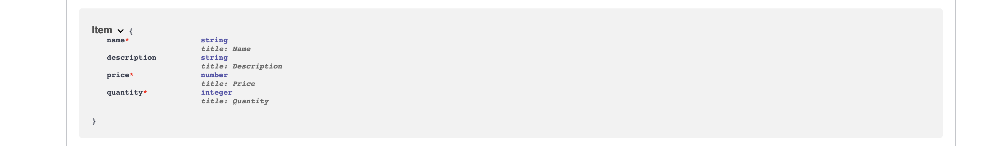
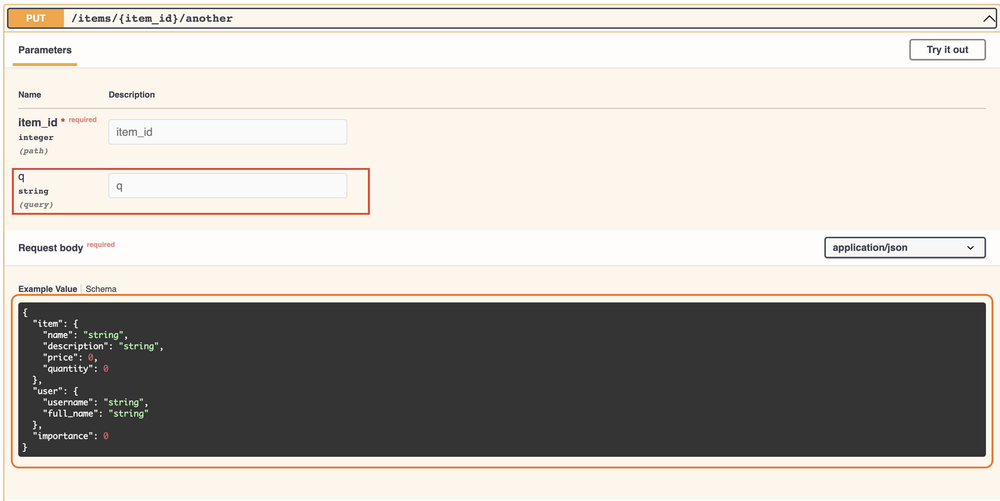

# Request Body

Request bodies are typically used with “create” and “update” operations (POST, PUT, PATCH).
For example, when creating a resource using POST or PUT, the request body usually contains the representation of the resource to be created.

To declare a **request body**, you need to use **Ellar `Serializer`**.

!!! info
    Under the hood **Ellar** uses <a href="https://pydantic-docs.helpmanual.io/" class="external-link" target="_blank">Pydantic</a> models with all their power and benefits.

## Import Serializer

First, you need to import `Serializer` from `ella.serializer`:

```python
# project_name/apps/items/controllers.py
from ellar.serializer import Serializer

# class Item(Serializer):
#     name: str
#     description: str = None
#     price: float
#     quantity: int

```

## Create your data model

Then you declare your data model as a class that inherits from `Serializer`.

Use standard Python types for all the attributes:

```python
# project_name/apps/items/controllers.py

from ellar.serializer import Serializer
from ellar.common import Controller, post
from ellar.core import ControllerBase


class Item(Serializer):
    name: str
    description: str = None
    price: float
    quantity: int


@Controller
class ItemsController(ControllerBase):
    @post("/")
    def create(self, item: Item):
        return item
```

Note: if you use **`None`** as the default value for an attribute, it will become optional in the request body.
For example, this model above declares a JSON "`object`" (or Python `dict`) like:

```JSON
{
    "name": "Alexis",
    "description": "An optional description",
    "price": 400.00,
    "quantity": 6
}
```

...as `description` is optional (with a default value of `None`), this JSON "`object`" would also be valid:

```JSON
{
    "name": "Alexis",
    "price": 200.00,
    "quantity": 12
}
```

## Declare it as a parameter

To add it to your *path operation*, declare it the same way you declared the path and query parameters:

```python
# project_name/apps/items/controllers.py

from ellar.serializer import Serializer
from ellar.common import Controller, post
from ellar.core import ControllerBase


class Item(Serializer):
    name: str
    description: str = None
    price: float
    quantity: int


@Controller
class ItemsController(ControllerBase):
    @post("/")
    def create(self, item: Item):
        return item
```

... and declare its type as the model you created, `Item`.

## Results

With just that Python type declaration, **Ellar** will:

* Read the body of the request as JSON.
* Convert the corresponding types (if needed).
* Validate the data.
    * If the data is invalid, it will return a nice and meaningful error, indicating exactly where and what the incorrect data was.
* Give you the received data in the parameter `item`.
    * Because you declared it in the function to be of type `Item`, you will also have all the editor support
      (completion, etc.) for all the attributes and their types.
* Generate <a href="https://json-schema.org" class="external-link" target="_blank">JSON Schema</a> definitions for
  your models, and you can also use them anywhere else you like if it makes sense for your project.
* Those schemas will be part of the generated OpenAPI schema, and used by the automatic documentation <abbr title="User Interfaces">UI's</abbr>.

## Automatic Docs

The JSON Schemas of your models will be part of your OpenAPI generated schema, and will be shown in the interactive API docs:



... and they will be also used in the API docs inside each *path operation* that needs them:


## Request Body + Path parameters

You can declare path parameters **and** body requests at the same time.

**Ellar** will recognize that the function parameters that match path parameters should be **taken from the path**, and that function parameters that are declared with `Serializer` should be **taken from the request body**.

```python
# project_name/apps/items/controllers.py

from ellar.serializer import Serializer
from ellar.common import Controller, post, put
from ellar.core import ControllerBase


class Item(Serializer):
    name: str
    description: str = None
    price: float
    quantity: int

@Controller
class ItemsController(ControllerBase):
    @post("/")
    def create(self, item: Item):
        return item
    
    @put("/items/{item_id}")
    def update(self, item_id: int, item: Item):
        return {"item_id": item_id, "item": item.dict()}
```

## Request Body + Path + Query parameters

You can also declare **body**, **path** and **query** parameters, all at the same time.

**Ellar** will recognize each of them and take the data from the correct place.

```python
# project_name/apps/items/controllers.py

from ellar.serializer import Serializer
from ellar.common import Controller, post, put
from ellar.core import ControllerBase


class Item(Serializer):
    name: str
    description: str = None
    price: float
    quantity: int

@Controller
class ItemsController(ControllerBase):
    @post("/")
    def create(self, item: Item):
        return item
    
    @put("/{item_id}")
    def update(self, item_id: int, item: Item, q: str):
        return {"item_id": item_id, "item": item.dict(), "q": q}
```

The function parameters will be recognized as follows:

* If the parameter is also declared in the **path**, it will be used as a path parameter.
* If the parameter is of a **singular type** (like `int`, `float`, `str`, `bool`, etc.), it will be interpreted as a **query** parameter.
* If the parameter is declared to be of the type of **Serializer** (or Pydantic `BaseModel`), it will be interpreted as a request **body**.

!!! info
    In here, we have combined both `Serializers` and `Controllers` in one file. This is for the convenience of writing this documentation.
    It's advised to have all your serializers in `schemas.py` and then import them over to `controllers.py` if needed.

## Singular values in body
The same way there is a `Query` and `Path` to define extra data for query and path parameters, 
**Ellar** provides an equivalent `Body`.

For example, extending the previous model, you could decide that you want to have another key `importance` in the same body, besides the `item` and `user`.

If you declare it as is, because it is a singular value, **Ellar** will assume that it is a query parameter.

But you can instruct **Ellar** to treat it as another body key using Body:

```python
# project_name/apps/items/controllers.py

from ellar.serializer import Serializer
from ellar.common import Controller, Body, post, put
from ellar.core import ControllerBase
from pydantic import BaseModel


class Item(Serializer):
    name: str
    description: str = None
    price: float
    quantity: int


class User(BaseModel):
    username: str
    full_name: str


@Controller
class ItemsController(ControllerBase):
    @post("/")
    def create(self, item: Item):
        return item
    
    @put("/{item_id}")
    def update(self, item_id: int, item: Item, q: str):
        return {"item_id": item_id, "item": item.dict(), "q": q}
    
    @put("/{item_id}/another")
    async def update_another(self, item_id: int, item: Item, user: User, importance: int = Body()):
        results = {"item_id": item_id, "item": item, "user": user, "importance": importance}
        return results
```
In this case, **Ellar** will expect a body like:

```json
{
    "item": {
        "name": "Foo",
        "description": "The pretender",
        "price": 42.0,
        "tax": 3.2
    },
    "user": {
        "username": "dave",
        "full_name": "Dave Grohl"
    },
    "importance": 5
}
```

## Multiple body params and query
Of course, you can also declare additional `query` parameters whenever you need, additional to anybody parameters.

As, by default, singular values are interpreted as query parameters, you don't have to explicitly add a `Query`, you can just do:

For example:

```python
# project_name/apps/items/controllers.py

from ellar.serializer import Serializer
from ellar.common import Controller, Body, post, put
from ellar.core import ControllerBase
from pydantic import BaseModel


class Item(Serializer):
    name: str
    description: str = None
    price: float
    quantity: int


class User(BaseModel):
    username: str
    full_name: str


@Controller
class ItemsController(ControllerBase):
    @post("/")
    def create(self, item: Item):
        return item
    
    @put("/{item_id}")
    def update(self, item_id: int, item: Item, q: str):
        return {"item_id": item_id, "item": item.dict(), "q": q}
    
    @put("/{item_id}/another")
    async def update_another(self, item_id: int, item: Item, user: User, importance: int = Body(), q: str = None):
        results = {"item_id": item_id, "item": item, "user": user, "importance": importance, "q": q}
        return results
```
And you will have this:



!!! info
    `Body` also has all the same extra validation and metadata parameters as `Query`,`Path` and others you will see later.
