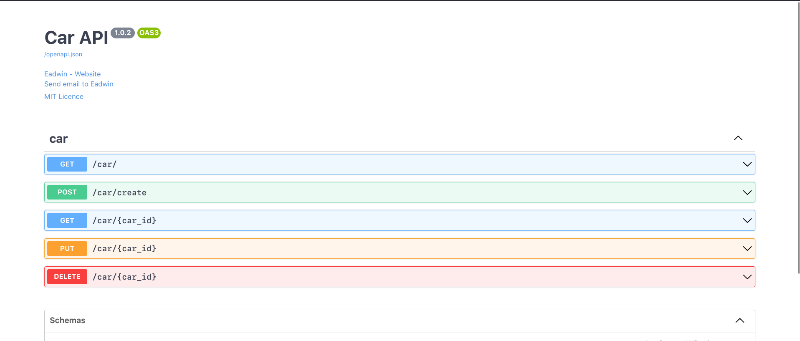

## Requirements
    Python >= 3.6
    Starlette >= 0.21.0
    pydantic >= 1.6
    Injector >= 0.16.1
    typer >= 0.6.1
    tomlkit >=0.11.1

## Virtual Environment
There are different ways to setting up virtual environment in python. So whichever way its setup, its fine.
It is but a necessity for this quick start. I like to use
```shell
python3.7 -m venv venv
```

## Installation
### Poetry Installation
For [Poetry](https://python-poetry.org/) usages
```shell
poetry add ellar
```

### Pip Installation
For normal pip installation
```shell
pip install ellar
```

## Create a project
To create an ellar project, you need to have a `pyproject.toml` available on your root directory.
This is necessary for ellar to store some `metadata` about your project. 

### Step 1
For Pip Users, you need to create `pyproject.toml` file
```shell
touch pyproject.toml
```
If you are using `Poetry`, you are ready to go

### Step 2
Run the ellar create project cli command,
```shell
ellar create-project carsite
```

## Run your project
Ellar runs [UVICORN - ASGI Server](https://www.uvicorn.org/) under the hood.
```shell
ellar runserver --reload
```
`--reload` is to watch for file changes

Now go to [http://127.0.0.1:8000](http://127.0.0.1:8000)


## Create a project module
A project module is a project app defining a group of controllers or services including templates and static files.
So, now we have a project created, lets add an app to the project.
```shell
ellar create-module car
```

## Add Schema
In `car/schema.py`, lets add some serializer for car input and output data
```python
from ellar.serializer import Serializer

class CarSerializer(Serializer):
    name: str
    model: str
    brand: str


class RetrieveCarSerializer(CarSerializer):
    pk: str
```

## Add Services
In `car/services.py`, lets create a dummy repository `CarDummyDB` to manage our car data.
```python
import typing as t
import uuid
from ellar.di import injectable, singleton_scope


@injectable(scope=singleton_scope)
class CarDummyDB:
    class CarDummyDBItem:
        pk: str

        def __init__(self, **data: t.Dict) -> None:
            self.__dict__ = data

        def __eq__(self, other):
            if isinstance(other, CarDummyDB.CarDummyDBItem):
                return self.pk == other.pk
            return self.pk == str(other)

    def __init__(self) -> None:
        self._data: t.List[CarDummyDB.CarDummyDBItem] = []

    def add_car(self, data: t.Dict) -> str:
        pk = uuid.uuid4()
        _data = dict(data)
        _data.update(pk=str(pk))
        item = self.CarDummyDBItem(**_data)
        self._data.append(item)
        return item.pk

    def list(self) -> t.List["CarDummyDB.CarDummyDBItem"]:
        return self._data

    def update(self, car_id: str, data: t.Dict) -> t.Optional["CarDummyDB.CarDummyDBItem"]:
        idx = self._data.index(car_id)
        if idx >= 0:
            _data = dict(data)
            _data.update(pk=str(car_id))
            self._data[idx] = self.CarDummyDBItem(**_data)
            return self._data[idx]

    def get(self, car_id: str) -> t.Optional["CarDummyDB.CarDummyDBItem"]:
        idx = self._data.index(car_id)
        if idx >= 0:
            return self._data[idx]

    def remove(self, car_id: str) -> t.Optional["CarDummyDB.CarDummyDBItem"]:
        idx = self._data.index(car_id)
        if idx >= 0:
            return self._data.pop(idx)
```
## Add Controller
In `car/controllers.py`, lets create `CarController`

```python
import typing as t
from ellar.common import Controller, delete, get, put, post
from ellar.core import ControllerBase
from ellar.exceptions import NotFound
from .schemas import CarSerializer, RetrieveCarSerializer
from .services import CarDummyDB


@Controller
class CarController(ControllerBase):
    def __init__(self, db: CarDummyDB) -> None:
        self.car_db = db

    @post("/create", response={200: str})
    async def create_cat(self, payload: CarSerializer):
        pk = self.car_db.add_car(payload.dict())
        return pk

    @put("/{car_id:str}", response={200: RetrieveCarSerializer})
    async def update_cat(self, car_id: str, payload: CarSerializer):
        car = self.car_db.update(car_id, payload.dict())
        if not car:
            raise NotFound("Item not found")
        return car

    @get("/{car_id:str}", response={200: RetrieveCarSerializer})
    async def get_car_by_id(self, car_id: str):
        car = self.car_db.get(car_id)
        if not car:
            raise NotFound('Item not found.')
        return car

    @delete("/{car_id:str}", response={204: dict})
    async def deleted_cat(self, car_id: str):
        car = self.car_db.remove(car_id)
        if not car:
            raise NotFound('Item not found.')
        return 204, {}

    @get("/", response={200: t.List[RetrieveCarSerializer]})
    async def list(self):
        return self.car_db.list()

```
## Register Service and Controller
In `car/module.py`, lets register `CarController` and `CarDummyDB`

```python
from ellar.common import Module
from ellar.core import ModuleBase
from ellar.di import Container

from .controllers import CarController
from .services import CarDummyDB


@Module(
    controllers=[CarController],
    providers=[CarDummyDB],
    routers=[],
)
class CarModule(ModuleBase):
    def register_providers(self, container: Container) -> None:
        # for more complicated provider registrations
        # container.register_instance(...)
        pass
```

## Registering Module
Ellar is not aware of `CarModule` yet, so we need to add it to the `modules` list of `ApplicationModule` at the `carsite/root_module.py`.
```python
from ellar.common import Module, exception_handler
from ellar.core import ModuleBase
from ellar.core.connection import Request
from ellar.core.response import JSONResponse, Response

from ellar.samples.modules import HomeModule
from .apps.car.module import CarModule


@Module(modules=[HomeModule, CarModule])
class ApplicationModule(ModuleBase):
    @exception_handler(404)
    def exception_404_handler(cls, request: Request, exc: Exception) -> Response:
        return JSONResponse(dict(detail="Resource not found."))

```
## Enabling OpenAPI Docs
To start up openapi, we need to go back to project folder in the `server.py`
then add the following below.
```python
import os

from ellar.constants import ELLAR_CONFIG_MODULE
from ellar.core.factory import AppFactory
from ellar.openapi import OpenAPIDocumentModule, OpenAPIDocumentBuilder
from .root_module import ApplicationModule

application = AppFactory.create_from_app_module(
    ApplicationModule,
    config_module=os.environ.get(
        ELLAR_CONFIG_MODULE, "carsite.config:DevelopmentConfig"
    ),
)

document_builder = OpenAPIDocumentBuilder()
document_builder.set_title('CarSite API') \
    .set_version('1.0.0') \
    .set_contact(name='Eadwin', url='https://www.yahoo.com', email='eadwin@gmail.com') \
    .set_license('MIT Licence', url='https://www.google.com')

document = document_builder.build_document(application)
module = application.install_module(OpenAPIDocumentModule, document=document)
module.setup_swagger_doc()
```

Now we can test our API at [http://127.0.0.1:8000/docs](http://127.0.0.1:8000/docs#/)
Please ensure your server is running

