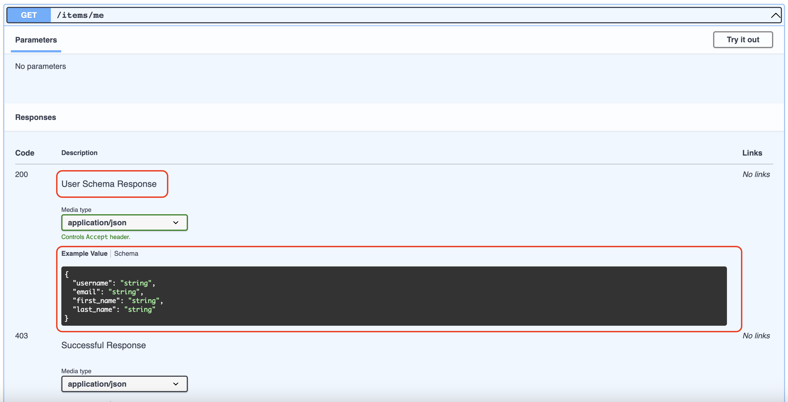

# **Response Models**

Each route handler has key-value pair of status codes and a response model. 
This response model holds information on the type of response to be returned.

```python
# project_name/apps/items/controllers.py

from ellar.common import Controller, get, Serializer, ControllerBase

class UserSchema(Serializer):
    username: str
    email: str = None
    first_name: str = None
    last_name: str = None


@Controller
class ItemsController(ControllerBase):
    @get("/me", response=UserSchema)
    def me(self):
        return dict(username='Ellar', email='ellar@example.com')
```

During route response computation, the `me` route handler response will evaluate to a
`JSONResponseModel` with `UserSchema` as content validation schema.

The resulting route responses will be:

```python
from ellar.common import Serializer
from ellar.common.responses.models import JSONResponseModel


class UserSchema(Serializer):
    username: str
    email: str = None
    first_name: str = None
    last_name: str = None

    
response = {200: JSONResponseModel(model_field_or_schema=UserSchema)}
```

For documentation purposes, we can apply some `description` to the returned response

```python
@get("/me", response=(UserSchema, 'User Schema Response'))
def me(self):
    return dict(username='Ellar', email='ellar@example.com')
```
This will be translated to:

```python

response = {200: JSONResponseModel(model_field_or_schema=UserSchema, description='User Schema Response')}
```



!!! info
    Each route handler has its own `ResponseModel` computation and validation. If there is no response definition, Ellar default the route handler model to `EmptyAPIResponseModel`.


## **Override Response Type**

When you use a `Response` class as response, a `ResponseModel` is used and the `response_type` is replaced with applied response class.

For example:

```python
# project_name/apps/items/controllers.py

from ellar.common import Controller, get, ControllerBase,PlainTextResponse, Serializer


class UserSchema(Serializer):
    username: str
    email: str = None
    first_name: str = None
    last_name: str = None

    
@Controller
class ItemsController(ControllerBase):
    @get("/me", response={200: PlainTextResponse, 201: UserSchema})
    def me(self):
        return "some text response."
```
This will be translated to:

```python
from ellar.common.responses.models import ResponseModel, JSONResponseModel
from ellar.common import PlainTextResponse

response = {200: ResponseModel(response_type=PlainTextResponse), 201: JSONResponseModel(model_field_or_schema=UserSchema)}
```

## **Response Model Properties**

All response model follows `IResponseModel` contract.

```python
import typing as t

from ellar.pydantic.fields import ModelField
from ellar.common import IExecutionContext, Response


class IResponseModel:
    media_type: str
    description: str
    get_model_field: t.Callable[..., t.Optional[t.Union[ModelField, t.Any]]]
    create_response: t.Callable[[IExecutionContext, t.Any], Response]
```
Properties Overview:

- `media_type`: Read from response media type. **Required**
- `description`: For documentation purpose. Default: `Success Response`. **Optional**
- `get_model_field`: returns response schema if any. **Optional**
- `create_response`: returns a response for the client. **Optional**

There is also a `BaseResponseModel` concrete class for more generic implementation.
And its adds extra properties for configuration purposes.

They include:

- `response_type`: Response classes eg. JSONResponse, PlainResponse, HTMLResponse. etc. Default: `Response`. **Required**
- `model_field_or_schema`: `Optional` property. For return data validation. Default: `None` **Optional**


## **Response Resolution Process**

When a route handler returns a response, Ellar goes through a resolution process to determine which response model to use. 
This process is handled by the `response_resolver` method and follows these steps:

### **1. Determine the Status Code**

The status code is determined in the following priority order:

1. **Single Model Case**: If only one response model is defined, its status code is used as the default.
   ```python
   @get("/item", response=UserSchema)  # Defaults to status code 200
   def get_item(self):
       return dict(username='Ellar')
   ```

2. **Response Object Status Code**: If a Response object was created and has a status code set, that takes precedence.
   ```python
   @get("/item", response={200: UserSchema, 201: UserSchema})
   def get_item(self, res: Response):
       res.status_code = 201  # This status code will be used
       return dict(username='Ellar')
   ```

3. **Tuple Return Value**: If the handler returns a tuple of `(response_obj, status_code)`, the status code from the tuple is used.
   ```python
   @get("/item", response={200: UserSchema, 201: UserSchema})
   def get_item(self):
       return dict(username='Ellar'), 201  # Returns with status code 201
   ```

### **2. Match to Response Model**

After determining the status code, Ellar matches it to the appropriate response model:

1. **Exact Match**: If a response model is defined for the specific status code, it's used.
2. **Ellipsis Fallback**: If no exact match is found but an `Ellipsis` (`...`) key exists, that model is used as a catch-all.
3. **Default Fallback**: If no match is found, `EmptyAPIResponseModel` is used with a warning logged.

Example with Ellipsis fallback:

```python
from ellar.common import Controller, get, ControllerBase, Serializer

class UserSchema(Serializer):
    username: str
    email: str = None

class ErrorSchema(Serializer):
    message: str
    code: int

@Controller
class ItemsController(ControllerBase):
    @get("/item", response={200: UserSchema, ...: ErrorSchema})
    def get_item(self, status: int):
        if status == 200:
            return dict(username='Ellar', email='ellar@example.com')
        # Any other status code will use ErrorSchema
        return dict(message='Error occurred', code=status), status
```

In this example, returning with status code 200 uses `UserSchema`, but any other status code (404, 500, etc.) will use `ErrorSchema` as the fallback.

!!! tip
    Using the `Ellipsis` (`...`) key is useful when you want to define a catch-all response model for various status codes (like error responses) without defining each one explicitly.

## **Different Response Models**
Let's see different `ResponseModel` available in Ellar and how you can create one too.

### **ResponseModel** 
Response model that manages rendering of other response types.

- Location: `ellar.common.responses.models.ResponseModel`
- response_type: `Response`
- model_field_or_schema: `None`
- media_type: `text/plain`

### **JSONResponseModel** 
Response model that manages `JSON` response.

- Location: `ellar.common.responses.models.json.JSONResponseModel`
- response_type: `JSONResponse` OR `config.DEFAULT_JSON_CLASS`
- model_field_or_schema: `Required`
- media_type: `application/json`

### **HTMLResponseModel** 
Response model that manages `HTML` templating response. see [`@render`]() decorator.

- Location: `ellar.common.responses.models.html.HTMLResponseModel`
- response_type: `TemplateResponse`
- model_field_or_schema: `None`
- media_type: `text/html`


### **FileResponseModel** 
Response model that manages `FILE` response. see [`@file`]() decorator.

- Location: `ellar.common.responses.models.file.FileResponseModel`
- response_type: `FileResponse`
- model_field_or_schema: `ellar.common.responses.models.file.FileResponseModelSchema`
- media_type: `Required`


### **StreamingResponseModel** 
Response model that manages `STREAMING` response. see [`@file`]() decorator.

- Location: `ellar.common.responses.models.file.StreamingResponseModel`
- response_type: `StreamingResponse`
- model_field_or_schema: `ellar.common.responses.models.file.StreamResponseModelSchema`
- media_type: `Required`


### **EmptyAPIResponseModel**
Default `ResponseModel` applied when no response is defined.

- Location: `ellar.common.responses.models.json.EmptyAPIResponseModel`
- response_type: `JSONResponse` OR `config.DEFAULT_JSON_CLASS`
- model_field_or_schema: `dict`
- media_type: `application/json`

## **Custom Response Model**

Lets create a new JSON response model.

```python
# project_name/apps/items/controllers.py

import typing as t
from ellar.common import Controller, get, ControllerBase, JSONResponse, Serializer
from ellar.common.responses.models import ResponseModel


class NoteSchema(Serializer):
    id: t.Union[int, None]
    text: str
    completed: bool


class JsonApiResponse(JSONResponse):
    media_type = "application/vnd.api+json"


class JsonApiResponseModel(ResponseModel):
    response_type = JsonApiResponse
    model_field_or_schema = t.List[NoteSchema]
    default_description = 'Successful JsonAPI Response'


@Controller
class ItemsController(ControllerBase):
    @get("/notes/", response=JsonApiResponseModel())
    def get_notes(self):
        return [
            dict(id=1, text='My Json Api Response 1', completed=True),
            dict(id=2, text='My Json Api Response 2', completed=True),
        ]
```


