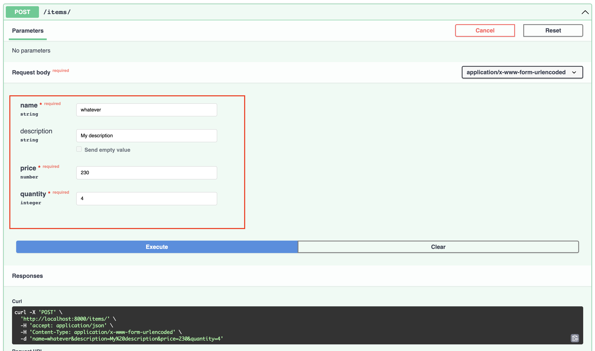

# **Form Data**

**Ellar** also allows you to parse and validate `request.POST` data
(aka `application x-www-form-urlencoded` or `multipart/form-data`).
When you need to receive form fields instead of JSON, you can use `Form`.

!!! info
    To use forms, first install [python-multipart](https://andrew-d.github.io/python-multipart/).

    E.g. `pip install python-multipart`.


## **Form Data as params** 

```python
# project_name/apps/items/controllers.py

from ellar.common import Controller, Form, post, ControllerBase


@Controller
class ItemsController(ControllerBase):
    @post("/login")
    def login(self, username: str = Form(), password: str = Form()):
        return {'username': username, 'password': '*****'}
```

Note the following:

1) You need to import the `Form` class from `ninja`
```python
from ellar.common import Form
```

2) Use `Form` as default value for your parameter:
```python
from ellar.common import Form

username: str = Form()
```

## **Using a Schema**

In a similar manner to [Body](body.md#declare-it-as-a-parameter), you can use
a Schema to organize your parameters.

```python
# project_name/apps/items/controllers.py

from ellar.common import Serializer, Controller, post, Form, ControllerBase


class Item(Serializer):
    name: str
    description: str = None
    price: float
    quantity: int


@Controller
class ItemsController(ControllerBase):
    @post("/")
    def create(self, item: Item = Form()):
        return item
```



## **Request form + path + query parameters**

In a similar manner to [Body](body.md#request-body-path-query-parameters), you can use
Form data in combination with other parameter sources.

You can declare query **and** path **and** form field, **and** etc... parameters at the same time.

**Ellar** will recognize that the function parameters that match path
parameters should be **taken from the path**, and that function parameters that
are declared with `Form(...)` should be **taken from the request form fields**, etc.

```python
# project_name/apps/items/controllers.py

from ellar.common import Serializer, Controller, Form, post, put, ControllerBase


class Item(Serializer):
    name: str
    description: str = None
    price: float
    quantity: int


@Controller
class ItemsController(ControllerBase):
    @post("/")
    def create(self, item: Item = Form()):
        return item
    
    @put("/{item_id}")
    def update(self, item_id: int, q: str, item: Item=Form()):
        return {"item_id": item_id, "item": item.dict(), "q": q}
```

## **Mapping Empty Form Field to Default**

Form fields that are optional, are often sent with an empty value. This value is
interpreted as an empty string, and thus may fail validation for fields such as `int` or `bool`.

This can be fixed, as described in the Pydantic docs, by using
[Generic Classes as Types](https://pydantic-docs.helpmanual.io/usage/types/#generic-classes-as-types).

```python
# project_name/apps/items/controllers.py

from ellar.common import Serializer, Controller, Form, post, put, ControllerBase
from pydantic.fields import ModelField
from typing import Generic, TypeVar

PydanticField = TypeVar("PydanticField")


class EmptyStrToDefault(Generic[PydanticField]):
    @classmethod
    def __get_validators__(cls):
        yield cls.validate

    @classmethod
    def validate(cls, value: PydanticField, field: ModelField) -> PydanticField:
        if value == "":
            return field.default
        return value


class Item(Serializer):
    name: str
    description: str = None
    price: EmptyStrToDefault[float] = 0.0
    quantity: EmptyStrToDefault[int] = 0
    in_stock: EmptyStrToDefault[bool] = True


@Controller
class ItemsController(ControllerBase):
    @post("/")
    def create(self, item: Item = Form()):
        return item
    
    @put("/{item_id}")
    def update(self, item_id: int, q: str, item: Item=Form()):
        return {"item_id": item_id, "item": item.dict(), "q": q}
    
    @put("/items-blank-default")
    def update(self, item: Item=Form()):
        return item.dict()
```
