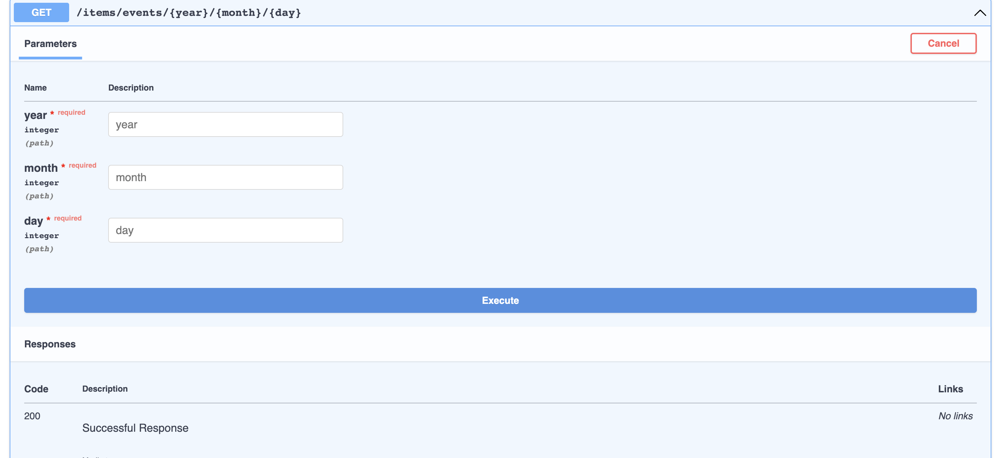
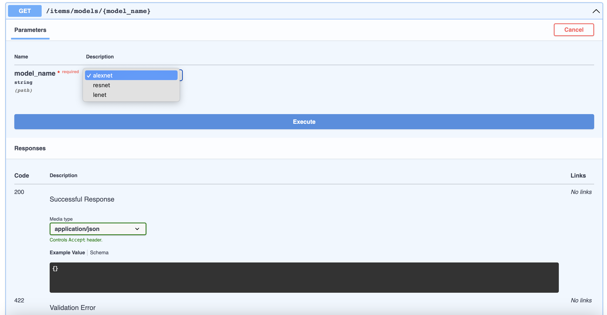

# **Path Parameters**
You can declare path "parameters" with the same syntax used by Python format-strings 
which is similar to [OpenAPI path parameters](https://swagger.io/docs/specification/describing-parameters/#path-parameters)


```python
# project_name/apps/items/controllers.py

from ellar.common import get, Controller, ControllerBase


@Controller
class ItemsController(ControllerBase):
    @get("/{item_id}")
    def read_item(self, item_id):
        return {"item_id": item_id}
```

The value of the path parameter `item_id` will be passed to your function as the argument `item_id`.

So, if you run this example and go to [http://localhost:8000/items/foo](http://localhost:8000/items/foo), you will see this response:

```JSON
{
  "item_id":"foo"
}
```

## **Path parameters with types**
You can declare the type of path parameter in the function using standard Python type annotations:

```python
# project_name/apps/items/controllers.py

from ellar.common import get, Controller, ControllerBase


@Controller
class ItemsController(ControllerBase):
    @get("/items/{item_id}")
    def read_item(self, item_id: int):
        return {"item_id": item_id}
```

In this case,`item_id` is declared to be an **`int`**. This will give you editor and linter support for error checks, completion, etc.

If you run this in your browser with [http://localhost:8000/api/items/3](http://localhost:8000/api/items/3), you will see this response:
```JSON
{
  "item_id":3
}
```

!!! tip
    Notice that the value your function received (and returned) is **3**, as a Python `int` - not a string `"3"`.
    So, with just that type declaration, **Ellar** gives you automatic request "parsing" and validation.


## **Data validation**
On the other hand, if you go to the browser at [http://localhost:8000/items/foo](http://localhost:8000/items/foo), you will see an HTTP error like this:

```JSON
{
    "detail": [
        {
            "loc": [
                "path",
                "item_id"
            ],
            "msg": "value is not a valid integer",
            "type": "type_error.integer"
        }
    ]
}
```
that is because the path parameter `item_id` had a value of `"foo"`, which is not an `int`.

The same error would appear if you provided a `float` instead of an `int`, as in:
[http://localhost:8000/items/4.2](http://localhost:8000/items/4.2)

## **Path Converters**

You can use [Starlette Path Converters](https://www.starlette.io/routing/#path-parameters) to help parse the path:

```python
# project_name/apps/items/controllers.py

from ellar.common import get, Controller, ControllerBase


@Controller
class ItemsController(ControllerBase):
    @get("/{item_id:int}")
    def read_item(self, item_id):
        return {"item_id": item_id}
```

In this case,`item_id` will be parsed as an **`int`**. If `item_id` is not a valid `int`, the url will not
match.  (e.g. if no other path matches, a *404 Not Found* will be returned)

!!! tip
    Notice that, since **Ellar** uses a default type of `str` for unannotated parameters, the value the
    function above received (and returned) is `"3"`, as a Python `str` - not an integer **3**. To receive
    an `int`, simply declare `item_id` as an `int` type annotation in the function definition as normal:

    ```python
    ...
    @get("/items/{int:item_id}")
    def read_item(self, item_id:int):
        return {"item_id": item_id}
    ```
 
### Path params with slashes

Starlette `path` converter allows you to handle path-like parameters:

For example, lets another route handler `some_view` and give it a path `/dir/{value:path}`.
What this means is that the parameter is `value`, and the last part, `:path`, tells it that the parameter should match any path.

```python
# project_name/apps/items/controllers.py

from ellar.common import get, Controller, ControllerBase


@Controller
class ItemsController(ControllerBase):
    @get('/dir/{value:path}')
    def some_view(self, value: str):
        return value
```
You can query this operation with [http://localhost:8000/items/dir/some/path/with-slashes](http://localhost:8000/items/dir/some/path/with-slashes) 
and your `value` will be equal to `"some/path/with-slashes"`

## **Multiple parameters**

You can pass as many variables as you want into `path`, just remember to have unique names and don't forget to use the same names in the function arguments.

```Python
# project_name/apps/items/controllers.py

from ellar.common import get, Controller, ControllerBase


@Controller
class ItemsController(ControllerBase):
    @get("/events/{year}/{month}/{day}")
    def events(self, year: int, month: int, day: int):
        return {"date": [year, month, day]}
```


## **Using Schema**

You can also use Schema to encapsulate path parameters that depend on each other (and validate them as a group):

```python
# project_name/apps/items/controllers.py

import datetime
from ellar.common import Serializer, get, Controller, Path, ControllerBase


class PathDate(Serializer):
    year: int
    month: int
    day: int

    def value(self):
        return datetime.date(self.year, self.month, self.day)

    
@Controller
class ItemsController(ControllerBase):
    @get("/events/{year}/{month}/{day}")
    def events(self, date: PathDate = Path()):
        return {"date": date.value()}
```

!!! note
    Notice that here we used a `Path` source hint to let **Ellar** know that this schema will be applied to path parameters.

## **Documentation**
Now, when you open your browser at [http://localhost:8000/docs](http://localhost:8000/docs), you will see the automatic, interactive, API documentation.


## **Using Enum**

If you have a path operation that receives a path parameter, 
but you want the possible valid path parameter values to be predefined, you can use a standard Python `Enum`.

For an example:

```python
# project_name/apps/items/controllers.py

from ellar.common import get, Controller, ControllerBase
from enum import Enum

class ModelName(str, Enum):
    alexnet = "alexnet"
    resnet = "resnet"
    lenet = "lenet"

    
@Controller
class ItemsController(ControllerBase):
    @get("/models/{model_name}")
    async def get_model(self, model_name: ModelName):
        if model_name is ModelName.alexnet:
            return {"model_name": model_name, "message": "Deep Learning FTW!"}
    
        if model_name.value == "lenet":
            return {"model_name": model_name, "message": "LeCNN all the images"}
    
        return {"model_name": model_name, "message": "Have some residuals"}
```

### Check the docs
Because the available values for the path parameter are predefined, the interactive docs can show them nicely:


