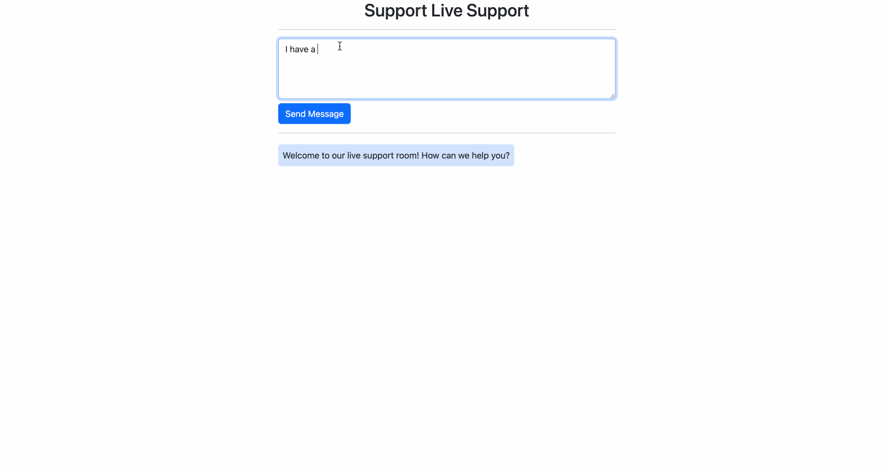

# **Websocket**

[WebSocket](https://developer.mozilla.org/en-US/docs/Web/API/WebSockets_API) is a powerful communication protocol that allows for two-way communication between a client and a server over a single, 
long-lived connection, making it an ideal tool for building real-time applications.

## **Creating a WebSocket Route**
In Ellar, you create websocket route using `ws_route` decorator.

```python
# project_name/apps/car/controller.py

from ellar.common import Controller, ControllerBase, ws_route


@Controller('/car')
class CarController(ControllerBase):
    @ws_route('/live-support')
    async def live_support(self):
        pass
```

Let's go deep with a more practical example. First we need to create a **html** with some javascript scripts that will connect to our websocket. 

```html
<!--project_name/apps/car/templates/ws-index.html --->

<!DOCTYPE html>
<html>
    <head>
        <title>Ellar Chat Demo</title>
        <link href="https://cdn.jsdelivr.net/npm/bootstrap@5.3.0-alpha3/dist/css/bootstrap.min.css"
              rel="stylesheet" integrity="sha384-KK94CHFLLe+nY2dmCWGMq91rCGa5gtU4mk92HdvYe+M/SXH301p5ILy+dN9+nJOZ"
              crossorigin="anonymous">
        <script src="https://cdn.jsdelivr.net/npm/bootstrap@5.3.0-alpha3/dist/js/bootstrap.bundle.min.js"
                integrity="sha384-ENjdO4Dr2bkBIFxQpeoTz1HIcje39Wm4jDKdf19U8gI4ddQ3GYNS7NTKfAdVQSZe"
                crossorigin="anonymous"></script>
    </head>
    <body>
        <div class="container" style="max-width: 40rem">
            <div class="mt-3 text-center">
               <h2>Support Live Support</h2>
            </div>
            <hr>
            <div class="row">
                <form action="" onsubmit="sendMessage(event)">
                    <textarea type="text" class="form-control" id="messageText" rows="4"></textarea>
                    <button class="btn btn-primary mt-2">Send Message</button>
                </form>
            </div>
            <hr>
            <ul id='messages' class="mx-auto list-unstyled">
            </ul>
        </div>
        <script>
            let ws = new WebSocket("ws://localhost:8000/car/live-support");
            ws.onmessage = function(event) {
                addMessage(event.data)
            };
            function sendMessage(event) {
                let input = document.getElementById("messageText")
                addMessage(input.value, true)
                ws.send(input.value)
                input.value = ''
                event.preventDefault()
            }

            function addMessage(data, inBound = false) {
                let messages = document.getElementById('messages')
                let container_message = document.createElement('li')
                let message = document.createElement('p')
                if (inBound) {
                    container_message.classList.add('d-flex', 'justify-content-end')
                    message.classList.add(...['p-2','rounded-2','bg-danger-subtle', 'my-1'])
                }else {
                    container_message.classList.add('d-flex')
                    message.classList.add(...[ 'p-2', 'rounded-2', 'bg-primary-subtle', 'my-1'])
                }
                message.innerHTML = data
                container_message.appendChild(message)
                messages.appendChild(container_message)
            }
        </script>
    </body>
</html>
```

Next, we add some code to the `live-feed` websocket route we created initially to accept connection and send messages to the client once there is a successful handshake.

```python
@Controller('/car')
class CarController(ControllerBase):
    @get('/ws-index')
    @render(template_name='ws-index.html')
    async def ws_index(self):
        return {}

    @ws_route('/live-support')
    async def live_support(self):
        ws = self.context.switch_to_websocket().get_client()
        await ws.accept()
        await ws.send_text('Welcome to our live support room!\nHow can we help you?')

        while True:
            try:
                data = await ws.receive_text()
                await ws.send_text(f'We have received you complain:<br><br><strong>"{data}"</strong><br><br>We shall get back to you.')
            except Exception as ex:
                assert ws.close()
                break
```
In example, we added `/ws-index`, to fetch the html file that has some javascript websocket connection to `/live-support` websocket route. 

So, when we visit the route below [http://127.0.0.1:8000/car/ws-index](http://127.0.0.1:8000/car/ws-index), you will have an interacting screen as shown below



In above example, `ws.receive_text()` was used to receive messages sent from the websocket client. 
Also messages can be received in json(`ws.receive_json()`), text(`ws.receive_text()`) and in bytes(`ws.receive_bytes()`)

In the same other, messages can be sent back in the same forms; text(`ws.send_text()`), json(`ws.send_json()`) and bytes(`ws.send_bytes()`)

## **Guards on websockets**
Guards works exactly as described earlier for a normal HTTP request. In the case of websocket, Guards are only active when a client is about to 
connect to the server. After a successful handshake between the server and the client, the guards actions are no longer involved in server to client communication and vice versa.

```python
from ellar.di import injectable
from ellar.common import Query, Guards, GuardCanActivate, IExecutionContext, ws_route

...
@injectable
class MyGuard(GuardCanActivate):
    async def can_activate(self, context: IExecutionContext) -> bool:
        print('MyGuard was called.')
        return False

...
@ws_route('/live-support')
@Guards(MyGuard)
async def live_support(self, name: str = Query('John')):
    ws = self.context.switch_to_websocket().get_client()
    await ws.accept()
    await ws.send_text(f'Welcome {name} to our live support room!\nHow can we help you?')

    while True:
        try:
            data = await ws.receive_text()
            await ws.send_text(f'We have received you complain:<br><br><strong>"{data}"</strong><br><br>We shall get back to you.')
        except Exception as ex:
            assert ws.close()
            break
```
In the construction above, we applied `MyGuard` to `/live-suport` route function. 
And for a connection to `/live-suport` to be successful, `MyGuard` can_activate must return `True`.

## **Websocket handler Dependencies**
Websocket handler supports all route [handler parameters](../techniques/validations/index.md) except `Body` and `Forms`. 

Let's use a `Query` parameter on the `/live-feed` WebSocket route.
```python
from ellar.common import Query, ws_route
...
@ws_route('/live-support')
async def live_support(self, name: str = Query('John')):
    ws = self.context.switch_to_websocket().get_client()
    await ws.accept()
    await ws.send_text(f'Welcome {name} to our live support room!\nHow can we help you?')

    while True:
        try:
            data = await ws.receive_text()
            await ws.send_text(f'We have received you complain:<br><br><strong>"{data}"</strong><br><br>We shall get back to you.')
        except Exception as ex:
            assert ws.close()
            break
```
Now, when you visit this endpoint [http://127.0.0.1:8000/car/ws-index](http://127.0.0.1:8000/car/ws-index?name=ellar) again, you will see a
name query parameter attached to the welcome message.


## **Advance websocket usage**
The `ws_route` offers more than just defining a websocket route. It can also be used to define handlers for different sessions of a websocket route.
By setting `use_extra_handler=True` in `ws_route` decorator, we activate an in-built handler that gives the ability to 
manage different sessions of websocket differently like `on_connect`, `on_message` and `on_disconnect`

- `on_connect(websocket, **kwargs)`: handles client connection with the server.
- `on_message(websocket, data)`: handles messages sent from the client
- `on_disconnect(websocket, close_code)`: handles server disconnecting from client

!!! info
    This approach also enables message data type validation using `WsBody`. 
    `WsBody` is similar to [`Body`](../techniques/validations/body.md) but for websockets.

Let's rewrite the previous example, `/live-support` websocket route.
```python
# project_name/apps/car/controller.py

from ellar.common import Controller, ControllerBase, ws_route, get, render, WsBody, Guards
from starlette.websockets import WebSocket


@Controller('/car')
class CarController(ControllerBase):
    @get('/ws-index')
    @render(template_name='ws-index.html')
    async def ws_index(self):
        return {}

    @ws_route('/live-support', use_extra_handler=True, encoding='text')
    @Guards(MyGuard)
    async def live_support(self, data: str = WsBody()):
        ws = self.context.switch_to_websocket().get_client()
        await ws.send_text(f'We have received you complain:<br><br><strong>"{data}"</strong><br><br>We shall get back to you.')

    @ws_route.connect(live_support)
    async def live_support_connect(self, websocket: WebSocket):
        await websocket.accept()
        await websocket.send_text('Welcome to our live support room!\nHow can we help you?')

    @ws_route.disconnect(live_support)
    async def live_support_disconnect(self, websocket: WebSocket, code: int):
        await websocket.close(code)
```
In the construct above, we created `def live_support_connect` to handle connection to the `'/live-support'` websocket route and
`def live_support_disconnect` to handle disconnection from it. `def live_support_connect` and `def live_support_disconnect` 
takes `websocket` instance as only parameter and must be an **asynchronous** function.

On the other hand,`def live_support` function is now a **message receiver handler** and so, there is need to define a parameter with `WsBody`, 
in this case `data:str = WsBody()`. Message sent from client will be passed to `data` parameter after validation and procession by `WsBody`.
If validation fails, an error will be sent to the client and connection will be destroyed.

The **`encoding` = 'text'** states the **message** data structure that is required of the client when sending messages to the server.
There are other **`encoding`** types supported:

- `text`: allows only simple text messages as in the case above, e.g. `@ws_route('/path', use_extra_handler=True, encoding='text')` 
- `json`: allows json messages e.g. `@ws_route('/path', use_extra_handler=True, encoding='json')`
- `bytes`: allows byte messages e.g. `@ws_route('/path', use_extra_handler=True, encoding='bytes')`

**Simplifying the example above**

We can further simplify the example above by getting rid of the `live_support_connect` and `live_support_disconnect`
and let the inbuilt handler apply the default `connection` and `disconnection` actions. 

```python
# project_name/apps/car/controller.py

from ellar.common import ControllerBase, Controller, ws_route, get, render, WsBody


@Controller('/car')
class CarController(ControllerBase):
    @get('/ws-index')
    @render(template_name='ws-index.html')
    async def ws_index(self):
        return {}

    @ws_route('/live-support', use_extra_handler=True, encoding='text')
    async def live_support(self, data: str = WsBody()):
        ws = self.context.switch_to_websocket().get_client()
        await ws.send_text(f'We have received you complain:<br><br><strong>"{data}"</strong><br><br>We shall get back to you.')
```

## **Testing a Websocket Route**
You can use the same [TestClient](../basics/testing.md#testclient) to test WebSockets.

For this, you use the TestClient in a `with` statement, connecting to the WebSocket:

```python
# project_name/car/tests/test_controllers.py
from project_name.apps.car.controllers import CarController
from ellar.testing import Test, TestClient


class TestCarController:
    def setup(self):
        test_module = Test.create_test_module(
            controllers=[CarController,],
            config_module=dict(
                REDIRECT_SLASHES=True
            )
        )
        self.client: TestClient = test_module.get_test_client()

    def test_live_support_works(self):
        with self.client.websocket_connect('/car/live-support') as websocket_client:
            data = websocket_client.receive_text()
            assert data == 'Welcome to our live support room!\nHow can we help you?'

            websocket_client.send_text('Message from client')
            data = websocket_client.receive_text()
            assert data == 'We have received you complain:<br><br><strong>"Message from client"</strong><br><br>We shall get back to you.'
```
